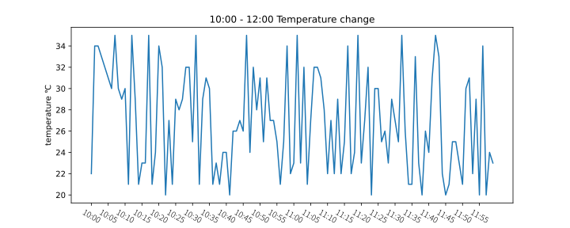

# 数据分析

## matplotlib

python 绘图工具

```python
from matplotlib import pyplot as plt
# x,y 必须是可迭代对象
x = range(2, 26, 2)
y = [12,34,45,32,12,34,56,23,12,34,12,23]
plt.plot(x, y)
plt.show()
```


### 图片样式调整

#### 大小和分辨率

```python
from matplotlib import pyplot as plt
# 图片大小，分辨率
fig = plt.figure(figsize=(10, 4), dpi=60)
x = range(2, 26, 2)
y = [12,34,45,32,12,34,56,23,12,34,12,23]
plt.plot(x, y)
plt.show()
```

#### 刻度

```python
from matplotlib import pyplot as plt
fig = plt.figure(figsize=(10, 4), dpi=60)
x = range(2, 26, 2)
y = [12,34,45,32,12,34,56,23,12,34,12,23]
plt.xticks(range(2, 25))
plt.plot(x, y)
plt.show()

```

]

#### 标签和标题

```python

from matplotlib import pyplot as plt
import random
from matplotlib import font_manager

# 支持中文，但是不太好用，实在需要再想办法
font_properties = font_manager.FontProperties(fname="/usr/share/fonts/opentype/noto/NotoSansCJK-Light.ttc")

fig = plt.figure(figsize=(10, 4), dpi=100)
x = range(0,120)
y = [random.randint(20, 35) for i in range(120)]
_xtisks_labels = [f"10:{i:02d}" for i in range(60)]
_xtisks_labels += [f"11:{i:02d}" for i in range(60)]
# rotation 旋转角度
plt.xticks(list(x)[::5], _xtisks_labels[::5], rotation=330,fontproperties = font_properties)
# x,y 轴标签
plt.xlabel('time')
plt.ylabel('temperature ℃')
# 标题
plt.title('10:00 - 12:00 Temperature change')
plt.plot(x, y)
plt.show()
```



#### 网格

```python
from matplotlib import pyplot as plt
fig = plt.figure(figsize=(10, 4), dpi=60)
x = range(2, 26, 2)
y = [12,34,45,32,12,34,56,23,12,34,12,23]
plt.xticks(range(2, 25))
plt.yticks(range(min(y), max(y)+1, 3))
plt.plot(x, y)
# 网格, 设置 alpha通道 透明度
plt.grid(alpha=0.2)
plt.show()
```


### 多条数据

```python
from matplotlib import pyplot as plt
fig = plt.figure(figsize=(10, 4), dpi=60)
x = range(2, 26, 2)
y_1 = [12,34,45,32,12,34,56,23,12,34,12,23]
y_2 = [21,34,65,22,34,12,26,34,23,75,16,13]
plt.xticks(range(2, 25))
plt.plot(x, y_1, label='liu')
plt.plot(x, y_2, label='mo')
# 图例, loc 位置
plt.legend(loc="upper left")
plt.show()
```


### 散点图

```python
from matplotlib import pyplot as plt
import random
x = range(1, 100)
y = [random.randint(1, 100) for _ in range(99)]
plt.scatter(x, y)
plt.show()
```


### 条形图

```python
from matplotlib import pyplot as plt
import random

x = ['a', 'b', 'c', 'd', 'e', 'f', 'g']
y = [random.randint(1, 20) for _ in range(7)]
plt.bar(x, y, width=0.2)
plt.show()
```


#### 横向条形图

```python
from matplotlib import pyplot as plt
import random

x = ['a', 'b', 'c', 'd', 'e', 'f', 'g']
y = [random.randint(1, 20) for _ in range(7)]
plt.barh(x, y, height=0.3)
plt.show()
```


#### 多实例条形图

```python
from matplotlib import pyplot as plt
import random

x = ['a', 'b', 'c', 'd', 'e', 'f', 'g']
y_1 = [random.randint(1, 20) for _ in range(7)]
y_2 = [random.randint(1, 20) for _ in range(7)]
y_3 = [random.randint(1, 20) for _ in range(7)]
plt.bar(range(len(x)), y_1, width=0.2, label="aaa")
plt.bar([i + 0.2 for i in range(len(x))], y_2, width=0.2, label="bbb")
plt.bar([i + 0.4 for i in range(len(x))], y_3, width=0.2, label="ccc")
plt.xticks([i + 0.2 for i in range(len(x))],x)
plt.legend(loc="upper center")
plt.show()
```


### 直方图

```python
from matplotlib import pyplot as plt
import random

a = [random.randint(1, 100) for _ in range(1000)]
d = 1 # 组距
num_bins = (max(a) - min(a)) // d
plt.hist(a, num_bins)
plt.xticks(range(min(a), max(a)+5, 5))
plt.grid()
plt.show()
```

### 饼图

```python
import matplotlib.pyplot as plt

# 数据准备
labels = 'Frogs', 'Hogs', 'Dogs', 'Logs'
sizes = [15, 30, 45, 10]
explode = (0, 0.1, 0, 0)  # 将"Hogs"部分突出显示

# 创建饼图
fig1, ax1 = plt.subplots()
ax1.pie(sizes, explode=explode, labels=labels, autopct='%1.1f%%',
        shadow=True, startangle=90)

# 设置饼图为圆形
ax1.axis('equal')  # Equal aspect ratio ensures that pie is drawn as a circle.

# 添加标题
plt.title('My Pie Chart')

plt.savefig('/home/new001/Documents/note/public_note/assets/pie.svg')

# 显示图表
plt.show()
```


### 图像保存

```python
from matplotlib import pyplot as plt
fig = plt.figure(figsize=(10, 4), dpi=60)
x = range(2, 26, 2)
y = [12,34,45,32,12,34,56,23,12,34,12,23]
plt.plot(x, y)
# 图像保存
plt.savefig('./t1.svg')
plt.show()
```

## numpy

numpy 中最核心的一个结构就是其 N 维数组对象 `ndarray`，它是一系列同类型数据的集合。
ndarray 中的每个元素的内存大小相同。
ndarray 的内部由以下内容组成：

- 指针：指向内存或内存映射文件中的数据
- dtype：描述数组中的数据类型
- shape：一个表示数组形状的元组，表示各个维度大小
- stride：一个跨度元组，其中的整数表示为了前进到当前维度的下一个元素需要跨过的字节数。

创建一个 ndarray 只需要调用 Numpy 的 array 函数即可：

```python
numpy.array(object, dType = None, copy = True, order = None, subok = False, ndmin = 0)
```

参数说明

| 名称   | 描述    |
|--------------- | --------------- |
| object   | 数组或嵌套的数列   |
| dType   | 数组元素的数据类型   |
| copy   | 对象是否需要复制   |
| order   | 创建数组的样式， C 为行方向， F 为列方向， A 为自动（默认）   |
| subok | 默认返回一个与基类类型一致的数组 |
| ndmin | 指定生成数组的最小维度 |

### 数组属性

Numpy 中数组的维数称为秩（rank），秩就是轴的数量，也就是数组的维度。
在 Numpy 中，每一个线性的数组称为一个轴（axis），也就是维度（dimensions）。

Numpy 中 ndarray 有一些重要的属性：

| 属性   | 说明    |
|--------------- | --------------- |
| ndarray.ndim    | 数组的维度   |
| ndarray.shape   | 数组的形状   |
| ndarray.size   | 数组中元素的总个数，相当于 ndarray.shape 各个轴上大小的乘积   |
| ndarray.dtype   | 数组中元素的数据类型   |
| ndarray.itemsize | 数组中每个元素的大小，以字节为单位 |
| ndarray.flags | 包含有关内存布局的信息，是否为只读等 |
| ndarray.real | 如果元素类型为实数，返回元素的实部 |
| ndarray.imag | 如果元素类为实数，返回元素的虚部 |
| ndarray.data | 实际存储数组元素的缓冲区 |

### 创建数组

numpy 中创建数组的方法有：

- 使用 numpy.array() 函数
- 使用 numpy.zeros() 函数，创建一个指定形状，指定数据类型的零数组。
- 使用 numpy.ones() 函数，创建一个指定形状，指定数据类型的数组，数组元素用 1 填充。
- 使用 numpy.empty() 函数，创建一个指定形状，指定数据类型的未初始化的数组。
- 使用 numpy.zeros_like() 函数，创建一个与指定数组形状相同，指定数据类型的零数组。
- 使用 numpy.ones_like() 函数，创建一个与指定数组形状相同，指定数据类型的数组，数组元素用 1 填充。

#### 从已有数组创建新数组

使用 numpy.asarray() 函数，可以将一个 Python 序列转换为 numpy 数组。

#### 从数值范围创建数组

- 使用 numpy.arange() 函数，创建一个指定范围内的一维数组，包括起始值，但不包括结束值。
- 使用 numpy.linspace() 函数，创建一个指定范围内的一维数组，这个数组是一个等差数列，可以包含结束值。
- 使用 numpy.logspace() 函数，创建一个指定范围内的一维数组，这个数组是一个等比数列，可以包含结束值。
