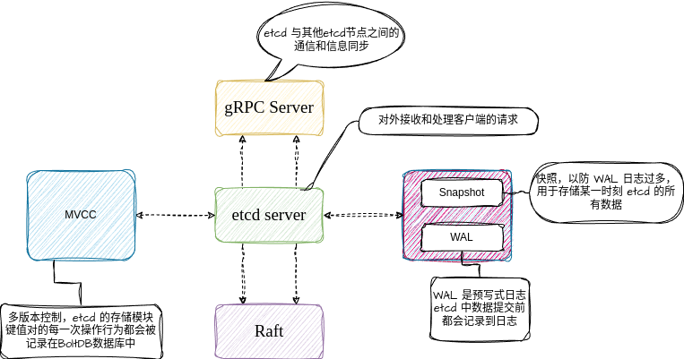

# etcd

etcd 是一个同于配置共享和服务发现的键值存储系统。归根结底是一个存储组件，且可以实现配置共享和服务发现。满足了 CAP（一致性，可用性，分区容错）中的CP。

## etcd 中常用的术语

| 术语| 描述 | 备注 |
| --------------- | --------------- | --------------- |
|Raft| Raft算法，etcd实现一致性的核心 | etcd有etcd-raft模块 |
|Follower|Raft中的从属节点|竞争leader失败|
|Leader|Raft中的领导节点，用于处理数据提交|Leader节点协调整个集群|
|Candidate|候选节点|当Follower接收Leader节点的消息超时会转变为Candidate|
|Node|Raft状态机的实例|Raft中涉及多个节点|
|Member|etcd实例，管理着对应的Node节点|可处理客户端请求|
|Peer|同一个集群中的另一个Member|其他成员|
|Cluster|etcd集群|拥有多个etcd member|
|Lease|租期|关键设置的租期，过期删除|
|Watch|检测机制|监控键值的变化|
|Term|任期|某个节点成为Leader，到下一次竞选的时间|
|WAL|预写式日志|用于持久化存储的日志格式|
|Client|客户端|向etcd发起请求的客户端|

## etcd 的应用场景

- 键值对存储：etcd 是一个用于键值对存储的组件，存储是 etcd 最基本的功能
- 服务注册与发现：etcd 基于 Raft 算法能够有力地保证分布式场景中的一致性
- 消息发布与订阅
- 分布式锁

## etcd 核心架构

