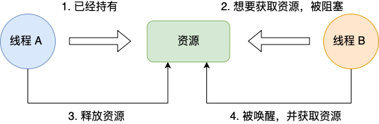

# juc

## java 线程的6种状态

1. 初始（NEW）
2. 运行（RUNNABLE）
3. 阻塞（BLOCKED）
4. 等待（WAITING）
5. 超时等待（TIMED_WAITING）
6. 终止（TERMINATED）


## 线程池

```java
// 基于 Executor 的线程池
ThreadPoolExecutor threadPoolExecutor = new ThreadPoolExecutor(
    1, // 核心线程数，线程池中一直存活的线程数
    5, // 最大线程数，当核心线程全部繁忙，且阻塞队列已满时，线程池会临时追加一个新线程，直到线程池中的线程数达到最大线程数
    60, // 线程空闲时间，当线程空闲超过该时间，且线程数大于核心线程数，线程池会临时回收线程
    TimeUnit.SECONDS, // 时间单位
    new ArrayBlockingQueue<>(5), // 阻塞队列，当核心线程全部繁忙时，新任务会进入阻塞队列，等待被执行
    Executors.defaultThreadFactory(), // 线程工厂
    new ThreadPoolExecutor.AbortPolicy() // 拒绝策略
);

// 当核心线程处于空闲状态时，允许销毁这些空闲的核心线程，默认是不允许的
threadPoolExecutor.allowCoreThreadTimeOut(true);

// 默认情况下，创建线程池之后不会立即创建线程，而是等待提交任务后再创建线程。要向立即创建线程，可以通过以下两种方式：

// 初始化所有核心线程
threadPoolExecutor.prestartAllCoreThreads();
// 初始化一个核心线程
threadPoolExecutor.prestartCoreThread();
```

### 拒绝策略

拒绝策略，内置了4种拒绝策略：

- AbortPolicy：默认的策略，丢弃新提交的任务并抛出 RejectedExecutionException 异常，让开发人员及时知道系统的运行状态。
- DiscardPolicy：直接丢弃新提交的任务，不抛出异常，建议在无关紧要的业务中使用。
- DiscardOldestPolicy：丢弃队列中最老的任务，然后把新提交的任务加到队列尾部，也就是队列最尾部，建议在系统负载比较重的时候使用。
- CallerRunsPolicy：直接在提交任务的线程中运行，也就是调用 execute() 方法的线程。

```java
// 自定义拒绝策略，实现 RejectedExecutionHandler 接口
class MyRejectedExecutionHandler implements RejectedExecutionHandler {
    @Override
    public void rejectedExecution(Runnable r, ThreadPoolExecutor executor) {

    }
}
```

### Executors

```java
// 创建一个固定大小的线程池，允许的队列长度为 Integer.MAX_VALUE
Executors.newFixedThreadPool(5);

// 创建一个单线程化的线程池，允许的队列长度为 Integer.MAX_VALUE
Executors.newSingleThreadExecutor();
// 创建一个可缓存的线程池，允许创建的线程数量为 Integer.MAX_VALUE
Executors.newCachedThreadPool();
```

### 线程池的钩子函数

- beforeExecute：线程池中某个线程开始执行任务之前调用
- afterExecute：线程池中某个线程执行完任务之后调用
- terminated：线程池关闭时调用

### 线程池关闭

- shutdownNow()：立即关闭线程池，不再接受新任务，将队列中的任务取消，返回未执行的任务列表，正在执行的任务继续执行，阻塞或等待的线程中断异常。
- shutdown()：停止接受新任务，等待所有任务完成。

## synchronized

synchronized 关键字是 Java 中最基本的同步机制，它允许一个线程访问一个资源，其他线程必须等待，直到该线程释放资源。
可以作用在方法上，也可以作用在代码块上。判断互斥的关键点在于：是否是同一个锁对象。

### 对象锁

```java
// 作用在方法上 
public synchronized void method() {
    // do something
}

// 作用在代码块上
public void method() {
    synchronized(this) {
        // do something
    }
}
```

### 类锁

线程同时访问同一个类的静态同步方法会互斥。

```java
// 作用在方法上
public synchronized static void method() {
    // do something
}

// 作用在代码块上
public static void method() {
    synchronized(Class.class) {
        // do something
    }
}
```

### synchronized 锁级别

synchronized 的锁级别有三种：偏向锁，轻量级锁，重量级锁。

在 HotSpot 中，一个对象的结构有三个部分：对象头，实例数据和内存对齐填充。


#### 偏向锁

在没有多线程竞争的情况下，访问 synchronized 修饰的同步代码，会先使用偏向锁。
在项目启动的时候，可能会使用轻量级锁，`-XX:BiasedLockingStartupDelay=4` ，会有4 秒的偏向锁延迟。

偏向锁是不会主动去释放锁的，当线程执行完同步代码块之后，不会主动释放锁，而是会一直保持偏向锁状态，直到出现锁竞争时，持有偏向锁的线程才会释放锁，然后发生锁升级。

偏向的意思：偏心、偏袒，也就是每一次都对某一个线程关爱有加，享受特殊的待遇;
在没有线程竞争的情况下，每次都是同一个线程访问同步代码块，就没有必要加锁和解锁，只需要第一次设置对象头标记，后续只需要判断以下对象头即可，提升了性能。
如果此时有其他线程加入了竞争，就会进行锁的升级。

偏向锁即是指，当一段同步代码一直被同一个线程访问时，即不存在多个线程竞争时，那么该线程在后续访问该同步代码时就会自动获得锁，从而降低了获取锁带来的消耗，提高了性能。

#### 轻量级锁

一旦有第二个线程加入了锁竞争，偏向锁就会升级为轻量级锁（自旋锁）。
这里要明确一下什么是锁竞争：如果多个线程轮流获取一个锁，但是每次获取锁的时候都很顺利，没有发生阻塞，那么就不存在锁竞争。
只有当某线程尝试获取锁时，发现该锁已经被占用，只能等待其释放，这才发生了锁的竞争。

没有抢到锁的线程会进行一定次数的重试，也叫自旋（忙等待），自旋的次数由前一次在同一个锁上的时间以及拥有锁的线程状态来决定。
如果在同一个锁对象上，当前正在自旋等待的线程刚刚获得到过锁，并且持有锁的线程正在运行中，那么虚拟机会认为该自旋等待的线程很有可能再次获得锁，
进而允许等待更长的时间来获取锁。如果对于某个锁，自旋的线程很少成功获取过，那在之后尝试获取该锁时，可能会忽略自旋等待的过程直接阻塞线程，避免浪费系统资源。

轻量级锁允许短时间的自旋忙等，换取线程在用户态和内核态之间切换的开销。

##### 轻量级锁的加锁过程

1. 在多个线程进入同步代码块的时候，如果同步对象（锁对象）为无锁状态（偏向锁标识为 0，锁标识为 01），
如果同步对象处于偏向锁的状态，会先恢复为无锁状态，
虚拟机首先在各个线程的栈帧中创建一个锁记录（Lock Record）空间用于存储同步对象的 Mark Word 的拷贝内容(官方:Displaced Mark Word)
2. 然后线程尝试使用 CAS 将对象头中的 Mark Word 替换为指向锁记录的指针，并将锁记录中的 owner 指针指向对象头中的 Mark Word。
3. 如果更新失败，虚拟机首先会检查锁对象的 Mark Word 是否是指向当前线程的锁记录，如果是就说明了当前线程已经拥有了这个锁对象
4. 将 copy 的 mark word 中的锁标识改为00，表示加锁成功。


##### 轻量级锁的解锁过程

轻量级锁在解锁时，会使用 CAS 将之前复制到栈帧中的 Displaced Mark Word 复制回锁对象中的 Mark Word 中，复制成功后之前在自旋的线程就能获取到锁。
如果之前自旋的线程没有获取到锁（有别的自旋线程抢了或者之前抢到锁的线程还没释放），说明同时存在两个及以上的线程在竞争这把锁，轻量级锁就会升级为重量级锁。

#### 重量级锁

重量级锁依赖操作系统的互斥锁，会把正在等待获取锁的线程进行阻塞，阻塞时不消耗 CPU，但是阻塞或唤醒一个线程时，需要系统调度，从用户态转到内核态，比较耗时。
膨胀为重量级锁后，那么锁对象会与一个 moniter(监视器锁)关联。

## 死锁

死锁只有同时满足四个条件才会发生：

- 互斥条件
- 持有并等待条件
- 不可剥夺条件
- 循环等待条件

**互斥条件**是指***多个线程不能同时使用同一个资源***。比如下图，如果线程 A 已经持有了资源，就不能被线程 B 持有，线程 B 只能等待直到线程 A 释放了资源。



**持有并等待条件**是指当线程 A 已经持有了资源 1,又想申请资源 2，而资源 2 已经被线程 C 持有了，所以线程 A 就会***处于等待状态，但是在等待的时候并不会释放自己已经持有的资源***。


**不可剥夺条件**是指当线程已经持有了资源，***在自己使用完成之前不能被其他的线程获取，***线程 B 如果也想使用资源，就必须等待线程 A 使用完并释放后才能获取。


**循环等待条件**是指在死锁发生的时候，***两个线程获取资源的顺序构成了环形链***。


### 死锁如何解决

只要破坏产生死锁的任一条件即可破坏死锁。

1. 互斥条件：这是互斥锁的最基本要求，不能破坏。
2. 持有并等待：一次性获取所有的锁资源，避免等待
3. 不可剥夺：占用资源的线程如果进一步获取其他的资源时，如果获取不到就主动释放自己的资源。
4. 可以按顺序获取锁。

## 内存可见性

如果一个线程修改了共享变量的值，其他线程也能读到最新写入的值，那就是内存可见的，否则就是内存不可见的;

## 原子性

一个指令或多个指令在执行的过程中不允许被中断，对应到代码中就是一段代码的执行不能被拆分。

## 有序性

程序的执行顺序按照代码的先后顺序执行

## volatile

使用 `volatile` 关键字可以保证共享变量在多线程之间的内存可见性，以及可以防止指令重排序。
`volatile` 只能修饰**类变量** 和 **实例变量**

```java
private volatile static int var = 10;

private volatile int var = 10;
```

**volatile 具有可见性和有序性**， **synchronized 具有可见性、有序性和原子性**。

volatile 和 synchronized 都是通过 **内存屏障**，来保证可见性和有序性。

## 单例模式

一个类只能够产生一个实例对象，保证了在多线程情况下的创建唯一的实例对象的解决方案。

### 饿汉式

在类加载的时候就初始化创建了对象。因为类只会被加载一次，所以天然保证了单例。

```java
// 直接初始化
public final class Singleton {
  private static final Singleton instance = new Singleton();

  private Singleton(){}
  public Singleton getInstance() {
    return instance;
  }
}
```

```java
// 静态代码块：在类第一次被加载进来的时候执行，仅执行一次，发生在任何对象创建之前，以及任何静态方法调用之前。
// 实例代码块：实例代码块就是不被 static 修饰的代码块，在构造方法之前执行，即对每个对象都会执行。
public final class Singleton {
  private static Singleton instance = null;

  static {
    instance = new Singleton();
  }

  private Singleton(){}

  public Singleton getInstance() {
    return instance;
  }
}
```

```java
public enum Singleton {
  INSTANCE;

  public String sayHello() {
    return "hello";
  }
}
```

### 懒汉式

懒加载，在需要的时候再创建对象，多线程条件下，编码不严谨可能会创建出多个对象出来。

```java
// synchronized 互斥写法, 保证了同一个时间只有一个线程可以执行代码，性能较差
public final class Singleton {
  private static Singleton instance = null;
  
  private Singleton(){

  }

  public static synchronized Singleton getInstance() {
    if(null == instance) {
      instance = new Singleton();
    }
    return instance;
  }
}
```

```java
// Double-check 多线程首次获取对象需要互斥操作，之后获取对象都不需要加锁
public final class Singleton {
  private static Singleton instance = null;

  private Singleton() {}

  public static Singleton getInstance() {
    if(null == instance) {
      synchronized(Singleton.class) {
        if(null == instance) {
          instance = new Singleton();
        }
      }
    }
    return instance;
  }
}
```

Double-check 解决了多线程竞争时后续竞争锁的操作，但是在极端条件下会产生空指针的问题。
instance = new Singleton(); 的这个过程有 3 个动作。

1. 分配对象的内存空间
2. 初始化对象
3. 设置 instance 指向刚刚分配的内存地址

操作 2 依赖 1, 但是操作 3 不依赖操作 2， 所以可能会发生指令重排出现 1,3,2 的顺序，这时候虽然 instance 不为空，
但是对象有可能没有正确的初始化，然后调用这个未初始化完成的对象的方法就可能报错。

```java
// Double-check + volatile 禁止指令重排解决 DCL 的问题
public final class Singleton {
  private volatile static Singleton instance = null;

  private Singleton(){}

  public Singleton getInstance() {
    if(null == instance) {
      synchronized(Singleton.class) {
        if(null == instance) {
          instance = new Singleton();
        }
      }
    }
    return instance;
  }
}
```

```java
// 采用静态内部类的方式实现 懒汉 + 饿汉 组合的方式
public final class Singleton {

  private Singleton(){}

  private static class SingletonInner {
    private static Singleton instance = new Singleton();
  }

  public static Singleton() getInstance() {
    return SingletonInner.instance;
  }
}
```

### 饿汉式防止反射攻击

```java

public final class Singleton {
  private static Singleton instance = new Singleton();

  private Singleton(){}
  public Singleton getInstance() {
    return instance;
  }
}

// 通过反射去创建 Singleton 对象
Constructor<Singleton> constructor = Singleton.class.getDeclaredConstructor();
constructor.setAccessible(true); // 设置私有开放
Singleton instance = constructor.newInstance(); // 通过反射实例化了对象,破坏了单例
```

防止的方法就是在私有的构造方法中添加判断

```java

public final class Singleton {
  private static Singleton instance = new Singleton();

  public Singleton getInstance() {
    return instance;
  }


// 在私有的构造方法中添加判断是否实例化对象不为空,因为单例的对象已经在类加载的时候就初始化完成了，后面的肯定就是非法手段获取的了
  private Singleton(){
    if (null != instance) {
      throw new RuntimeException("不可以通过其他手段实例化该对象");
    }
  }
}
```

### 防止反序列化攻击

```java
// 在单例的类中添加一个名为 readResolve() 的方法
public Object readResolve() {
  return instance;
}
```

## AQS

AbstractQueuedSynchronizer：本质上就是一个 JUC 下的一个基础类，大多数的 JAVA 并发工具就是基于 AQS 实现。
AQS 中有 3 点核心内容：

- int state
  - 比如 ReentrantLock 获取锁的方式都是对 state 变量做修改实现的。
  - CountDownLatch 也是基于 state 作为计数器
  - Semaphore 也是基于 state 记录资源的个数
- Node 对象组成的双向链表
  - 比如 Reentrantlock ,有一个线程没有拿到锁资源，当前的线程就需要等待，需要将线程封装为一个 Node 对象添加到双向链表中，然后挂起等待。
- Node 对象组成的单项链表
  - 在 synchronized 中，线程没有抢到锁会将该线程放到一个 EntryList 中，抢到锁的线程执行 wait 方法会将线程挂起，
  记录在 WaitSet 中，在 AQS 中 比如 Reentrantlock 执行了 await() 方法，此时这个线程就需要封装到 Node 对象，并添加到单向链表中。

### AQS 和 Lock 的关系

Sync 是一个抽象类，定义了锁的一些操作。其实现子类有 FairSync（公平锁）和 NoFairSync（非公平锁）

```java
// 非公平锁
final boolean initialTryLock() {
    Thread current = Thread.currentThread();
    // 不管当前是否有线程已经获取到锁了，直接一手 CAS 尝试获取锁一次
    if (compareAndSetState(0, 1)) { // first attempt is unguarded
        // 如果成功了就将当前的线程设置为拥有独占访问权的线程
        setExclusiveOwnerThread(current);
        return true;
    } else if (getExclusiveOwnerThread() == current) {
        int c = getState() + 1;
        if (c < 0) // overflow
            throw new Error("Maximum lock count exceeded");
        setState(c);
        return true;
    } else
        return false;
}


// 公平锁
final boolean initialTryLock() {
    Thread current = Thread.currentThread();
    int c = getState();
    if (c == 0) {
        if (!hasQueuedThreads() && compareAndSetState(0, 1)) {
            setExclusiveOwnerThread(current);
            return true;
        }
    } else if (getExclusiveOwnerThread() == current) {
        if (++c < 0) // overflow
            throw new Error("Maximum lock count exceeded");
        setState(c);
        return true;
    }
    return false;
}
```

## ReentrantLock

Sync 隐式设置了锁，Lock 是显示设置信息。

ReentrantLock 是 Lock 的默认实现

1. 可重入锁：可重入锁是指同一个线程可以多次的获取同一把锁; Reentrantlock 和关键字 synchronized 都是可冲入锁。
2. 可中断锁：可中断锁是指线程在获取锁的过程中，是否可以执行线程相应的线程中断操作。 synchronized 是不可中断的，ReentrantLock 是可中断的。
3. 公平锁和非公平锁：公平锁是指多个线程尝试获取同一把锁时，获取锁的顺序按照线程到达的先后顺序获取，而不是随即插队的方式获取。
synchronized 是非公平锁，ReentrantLock 两种都可以实现，默认是非公平锁。

为什么有公平锁/非公平锁的设计，又为什么默认非公平呢。
**非公平锁更能充分利用 CPU 的时间片，尽量减少 CPU 的空闲时间**

```java
private static ReentrantLock lock = new ReentrantLock();


public void run() {
  lock.lock();
  // 执行方法逻辑
  finally {
    if (lock.isHeldByCurrentThread()) {
      lock.unlock();
    }
  }
}
```

### tryLock

ReentrantLock 提供了一个尝试获取到锁的机制

使用 `tryLock()` 可以选择传入的时间参数，表示等待指定的时间，无参则表示立即返回锁申请的结果。true 表示获取锁成功，false 表示获取锁失败。

### 互斥锁和读写锁

ReentrantReadWriteLock 提供了读锁和写锁。
读锁之间共享读锁，写锁是互斥的。要么多个读锁一起执行，要么就只有一个写锁执行

## ThreadLocal

ThreadLocal 是线程的本地变量。

## hashmap

hashmap 的初始容量为 16, 负载因子为 0.75

## ConcurrentHashMap 的底层实现原理

数据结构：Segment[] + HashEntry[] + 链表;

Segment 继承了 ReentrantLock，采用分段锁(默认 16)，每把锁只作用于一个 Segment;
