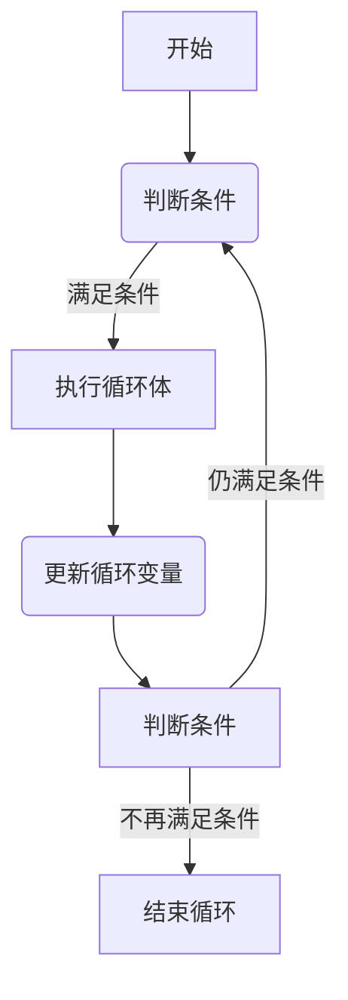
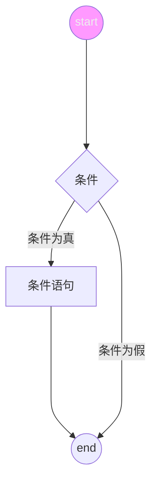

# lua

## 注释

```lua
-- 单行注释

--[[
多行注释
多行注释
--]]
```

## 关键词

|   and    | break |  do   |  else  |
| :------: | :---: | :---: | :----: |
|  elseif  |  end  | false |  for   |
| function |  if   |  in   | local  |
|   nil    |  not  |  or   | repeat |
|  return  | then  | true  | until  |
|  while   | goto  |       |        |

一般约定，以下划线开头连接一串大写字母的名称（比如\_VERSION）被保留用于Lua内部的全局变量。

## 全局变量

在默认情况下，变量总是认为是全局的。

全局变量不需要声明，给一个变量赋值后即创建了这个全局变量，访问一个没有初始化的全局变量也不会出错，只不过得到的结果是：`nil`

```shell
> print(b)
nil
> b=10
> print(b)
10
```

如果要删除一个全局变量，只需要将变量赋值为`nil`。

## Lua数据类型

| 数据类型 | 描述                                                             |
| -------- | ---------------------------------------------------------------- |
| nil      | 表示一个无效值，在条件表达式中相当于false。                      |
| boolean  | false 和 true                                                    |
| number   | 双精度类型的实浮点数                                             |
| string   | 字符串由一对双引号或单引号表示                                   |
| function | 由c或lua编写的函数                                               |
| userdata | 表示任意存储在变量中的c数据结构                                  |
| thread   | 表示执行的独立线路，用于执行协同程序                             |
| table    | 一个关联数组，索引可以是数字、字符串或表类型，用\{\}创建一个空表 |

## Lua变量

Lua 变量有三种类型：全局变量、局部变量、表中的域。
Lua 中的变量全是全局变量，哪怕是语句块或函数里，除非用`local`显示声明为局部变量。
局部变量的作用域从声明位置开始到所在语句块结束。

### 赋值语句

Lua 可以对多个变量同时赋值。

```lua
a, b = 10, "hello"
```

Lua 会先计算右边所有的值再进行赋值操作，所有可以这样交换变量的值：

```lua
x, y = y, x
a[i], a[j] = a[j], a[i]
```

当变量个数的值的个数不一致时，Lua 会一直以变量的个数为基础采用策略：

1. 变量个数 > 值的个数 按变量个数补足nil
2. 值的个数 > 变量个数 多余的值会被忽略

函数可以返回多个值

```lua
-- func返回两个值，第一个赋值给a，第二个赋值给b
a, b = func()
```

应该尽可能地使用局部变量，既可以避免命名冲突，又可以加快访问的速度。

## Lua 循环



### while

```lua
while(condition)
do
  statements
end
```

### for

Lua 中for循环有两大类，数值for循环和泛型for循环

#### 数值for循环

```lua
-- var从exp1变化到exp2，步长为exp3，并执行一次执行体。exp3可选，如果不指定，默认为1。
for var=exp1,exp2,exp3 do
  <执行体>
end
```

#### 泛型for循环

泛型for循环通过一个迭代器函数来遍历所有值，类似java中的foreach

```lua
-- 打印数组a的所有值
-- i是数组索引，v是对应索引的数组元素值
a = { "a", "b", "c" }
for i, v in ipairs(a) do
	print(i, v)
end
```

### break & goto

break退出当前循环。

goto语句允许将控制流程无条件地转到被标记的语句处。

```lua
goto lable
```

Lable 的格式为：

```lua
::Lable::
```

使用

```lua
local a = 1
:: lable :: print("-- goto lable --")

a = a + 1
if a < 3 then
  goto lable
end
```

## Lua 流程控制



控制结果的条件表达式结果可以是任何值。Lua 认为false和nil为假，true和非nil为真。
要注意Lua 中的0为true。

```lua
if(condition)
then
  -- condition is true
else
  condition is false
end
```

```lua
if condition1 then
-- condition1 is true
elseif condition2 then
-- condition2 is true
else
	-- condition1 and condition2 both false
end
```

## Lua 函数

Lua 函数定义格式：

```lua
--[[
optional_function_scope: 该参数是可选的，指定函数为全局函数还是局部函数，未设置默认为全局函数。
result_params_comma_spearated: 函数返回值，Lua 函数可以返回多个值，每个值以逗号隔开。
--]]
optional_function_scope function function_name(arg1, arg2, arg3..., argn)
  function_body
  return result_params_comma_spearated
end
```

### 可变参数

Lua 函数可以接受可变数目的参数，和C语言类似，在函数参数列表中使用三点`...`表示函数有可变的参数。

```lua
function add(...)
 local s = 0
 for index, value in ipairs({ ... }) 2024-04-24T01:03:26
  s = s + value
 end
 return s
end

print(add(1, 2, 3, 34, 5, 6))
```

可以使用`select("#", ...)`来获取可变参数的数量。

## Lua 运算符

### 算术运算符

| 操作符 | 描述     |
| ------ | -------- |
| +      | 加法     |
| -      | 减法     |
| \*     | 乘法     |
| /      | 除法     |
| %      | 取余     |
| ^      | 乘幂     |
| -      | 负号     |
| //     | 整除运算 |

### 关系运算符

| 操作符 | 描述                     |
| ------ | ------------------------ |
| ==     | 等于，检测两个值是否相等 |
| ~=     | 不等于                   |
| >      | 大于                     |
| <      | 小于                     |
| >=     | 大于等于                 |
| <=     | 小于等于                 |

### 逻辑运算符

| 操作符 | 描述   |
| ------ | ------ |
| and    | 逻辑与 |
| or     | 逻辑或 |
| not    | 逻辑非 |

### 其他运算符

| 操作符 | 描述                 |
| ------ | -------------------- |
| ..     | 连接两个字符串       |
| #      | 返回字符串或表的长度 |

## Lua 字符串

Lua 中字符串可以使用`''`, `""` 或 `[[]]`包裹

在 Lua 中，要计算字符串的长度。可以使用`string.len`函数或`utf8.len`函数，包含中文的一般用`utf8.len`。

### 字符串操作

| 函数                                   | 用途                                 |
| -------------------------------------- | ------------------------------------ |
| string.upper(arg)                      | 字符串转大写                         |
| string.lower(arg)                      | 字符串转小写                         |
| string.gsub(main,find,replace,num)     | 字符串替换                           |
| string.find(str,sub,\[init, \[plain]]) | 返回子串的起始索引，init指定起始位置 |
| string.reverse(arg)                    | 字符串翻转                           |
| string.format(...)                     | 字符串格式化                         |
| string.char(arg)                       | 将整数数字转为字符串并拼接           |
| string.byte(arg\[,int])                | 将字符转为数字，int可以指定某个字符  |
| string.len(arg)                        | 计算字符串长度                       |
| string.rep(str,n)                      | 返回拷贝n次的字符串                  |
| ..                                     | 连接两个字符串                       |
| string.gmatch(str,pattern)             | 返回迭代器每次调用返回下个匹配的子串 |
| string.match(str, pattern, init)       | 返回第一个匹配的捕获结果             |
| string.sub(s,i,\[,j])                  | s截取的字符串，i开始，j结束，默认-1  |

### Lua 支持的字符类

- .(点)：与任何字符配对
- %a：与任何字母配对
- %c：与任何控制字符配对（如\n）
- %d：与任何数字配对
- %l：与任何小写字母配对
- %p：与任何标点配对
- %s：与空白字符配对
- %u：与任何大写字母配对
- %w：与任何字母、数字配对
- %x：与任何十六进制数配对
- %z：与任何代表0的字符配对
- %x（此处x是非字母非数字字符）：与字符x配对，主要用来处理表达式中有功能的字符（^$()%.[]\*+ -?）的配对
- \[数个字符]：与任何[]中包含在[]的字符类配对
- \[^数个字符]：与任何不包含在[]中的字符配对

### 模式条目

- 单个字符类匹配该类别中任意单个字符；
- 单个字符跟一个`*`，将匹配零或多个该类的字符。匹配尽可能长的串；
- 单个字符跟一个`+`，将匹配一个或更多该类的字符。匹配尽可能长的串；
- 单个字符跟一个`-`，将匹配零或更多个该类的字符。与`*`不同，匹配尽可能短的串；
- 单个字符跟一个`?`，将匹配零或一个该类的字符。
- %n，这里n可以从1-9；这个条目匹配一个等于n号的子串。
- %bxy，这里的x和y是两个明确的字符；这个条目匹配以x开始y结束。
- %f\[set]，指边境模式；这个条目会匹配到一个位于set 内某个字符之前的一个空串。

## Lua 数组

Lua 中并没有专门的数组类型，而是使用一种被称为`table`的数据结构来实现数组的功能。
在Lua 索引值从`1`开始，也可以指定`0`开始。

```lua
local myArr = { 12, 34, 45, 56, 76, 87 }
for i = 1, #myArr do
	print(myArr[i])
end

for i = -2, #myArr do
	print(myArr[i])
end

-- 添加新数组到数组末尾
myArr[#myArr + 1] = 60

-- 删除第三个元素
table.remove(myArr, 3)
```

### 多维数组

```lua
array = {}
for i = 1,3 do
 array[i] = {}
  for j = 1, 3 do
    array\[i]\[j] = i * j
  end
end
```

## 迭代器

迭代器(iterator) 是一种对象，它能够用来遍历标准模板库容器中的部分或全部元素，每个迭代器对象代表容器中的确定的地址。

在 Lua 中迭代器是一种支持指针类型的结构，它可以遍历集合的每一个元素。

### 泛型 for 迭代器

泛型 for 在自己内部保存迭代函数，实际保存三个值：迭代函数、状态常量、控制变量。

```lua
for k, v in pairs(t) do
	print(k, v)
end
```

#### 无状态迭代器

```lua
array = { "google", "linux" }

for key, value in ipairs(array) do
	print(key, value)
end
```

```lua
function square(m, n)
	if n < m then
		n = n + 1
		return n, n * n
	end
end

for i, v in square, 3, 0 do
	print(i, v)
end
```

#### 多状态迭代器

很多情况，迭代器需要保存多个状态信息而不是简单的状态常量和控制变量，最简单的方法是使用闭包，还有一种方法就是将所有的状态信息封装到table中，将table作为迭代器的状态常量，因为这种情况下可以将所有的信息存放到table内，所以迭代器通常不需要第二个参数。

```lua
array = { "google", "linux" }

function elementInterator(collection)
	local index = 0
	local count = #collection
	-- 闭包函数
	return function()
		index = index + 1
		if index <= count then
			return collection[index]
		end
	end
end

for element in elementInterator(array) do
	print(element)
end
```

## Lua table（表）

table 是 Lua 的一种数据结构来创建不同的数据类型，如数组、字典等。

```lua
-- 初始化表
mytable = {}

-- 指定值
mytable[1] = "lua"

-- 移除引用
mytable = nil

-- lua 垃圾回收会释放内存
```

### Table 操作

| 方法                                       | 用途               |
| ------------------------------------------ | ------------------ |
| table.concat(table\[,seq\[,start\[,end]]]) | 连接表中的元素     |
| table.insert(table,\[pos,]value)           | 插入，默认尾插     |
| table.remove(table\[,pos])                 | 删除元素，默认尾删 |
| table.sort(table\[,comp])                  | 排序               |

## Lua 模块与包

模块类似一个封装库，从 Lua5.1开始， Lua 加入了标准的模块管理机制，可以把一些公用的代码放到一个文件里，以API接口的形式在其他敌方调用。

Lua 的模块由变量、函数等已知元素组成的table， 因此创建一个模块就是创建一个table， 然后把需要的常量、函数放入其中，最后返回这个table就行。

```lua
-- 定义一个模块
module = {}

-- 定义一个常量
module.constant = "this is a constant"

-- 定义一个函数
function module.func1()
 io.write("这是一个公有函数\n")
end

return module
```

### require 函数

Lua 提供了一个名为require的函数来加载模块。如：

```lua
require("<模块名>")
-- or
require "<模块名>"
-- 使用别名变量方便调用：
local m = require("module")
```

### 加载机制

对于自定义的模块，函数require由自己的文件加载策略，它会尝试从Lua文件或C程序库中加载模块。

当Lua启动后，会以环境变量`LUA_PATH`的值来初始化这个环境变量，如果没有找到这个环境变量，使用一个编译时定义的默认路径来初始化。

### C 包

C包在使用以前必须收件加载并连接，在大多数系统中最容易实现的方式时动态连接口机制。Lua 在loadlib函数中提供了所有动态连接的功能。这个函数有两个参数：库的绝对路径和初始化函数。

```lua
local path = "/usr/local/lua/lib/libuasocket.so"
local f = loadlib(path, "luaopen_socket")
```

loadlib 函数加载指定的库并连接到lua， 然而它并不打开库，反之它返回初始化函数作为Lua的一个函数，可以在Lua中调用。

```lua
local path = "/usr/local/lua/lib/libuasocket.so"
local f = assert(loadlib(path, "luaopen_socket"))
f() -- 真正打开库
```

## Lua 元表（Metatable）

在Lua table中我们可以访问对于的key来得到value值，但是却无法对两个table进行操作（比如相加）。

因此Lua提供了元表，允许我们改变table的值。

```lua
myTable = {} -- 普通表
mymetatable = {} -- 元表
setmetatable(mytable, mymetatable) -- 把mymetatable设置为mytable的元素
```

以上代码也可以直接写成一行：

```lua

mytable = setmetatable({},{})
```

以下为返回对象元素：

```lua
getmetatable(mytable) -- 返回mymetatable
```

### \_\_index 元方法

当通过键来访问table的时候，如果这个键没有值，那么Lua就会寻找该table的元表中的**index键。如果**index包含一个表格，Lua会在表格中查找相应的键。

> Lua 查找一个表元素时的规则，如下3个步骤：

1. 在表中查找，如果找到则返回该元素，找不到则继续
2. 判断该表是否有元表，如果没有元表返回nil，有元表则继续。
3. 判断元表有没有**index方法，如果**index方法为nil，则返回nil;如果**index是一个表，则重复1，2，3；如果**index是一个函数，则返回该函数的返回值。

### \_\_newindex 元方法

**newindex元方法用来对表更新，当你给表的一个缺少的索引赋值，解释器就会查找**newindex元方法；如果存在则调用这个函数而不是进行赋值操作，有\_\_newindex就操作Metatable，找不到则操作原表。

| 模式       | 描述         |
| ---------- | ------------ |
| \_\_add    | 对应运算符+  |
| \_\_sub    | 对应运算符-  |
| \_\_mul    | 对应运算符\* |
| \_\_div    | 对应运算符/  |
| \_\_mod    | 对应运算符%  |
| \_\_unm    | 对应运算符-  |
| \_\_concat | 对应运算符.. |
| \_\_eq     | 对应运算符== |
| \_\_lt     | 对应运算符<  |
| \_\_le     | 对应运算符<= |

### \_\_call 元方法

\_\_call 元方法在Lua调用一个值时调用。

### \_\_tostring 元方法

\_\_tostring 元方法用于修改表的输出行为。

## Lua 协同程序（coroutine）

| 方法                | 描述                             |
| ------------------- | -------------------------------- |
| coroutine.create()  | 创建协同程序                     |
| coroutine.resume()  | 重启协同程序                     |
| coroutine.yield()   | 挂起协同程序                     |
| coroutine.status()  | 查看coroutine状态                |
| coroutine.wrap()    | 创建协同程序，和create功能重复   |
| coroutine.running() | 返回正在跑的协同程序，返回线程号 |
