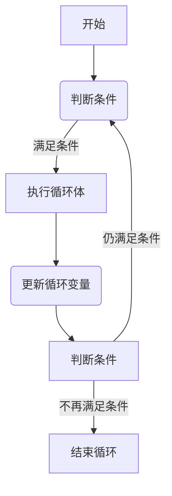
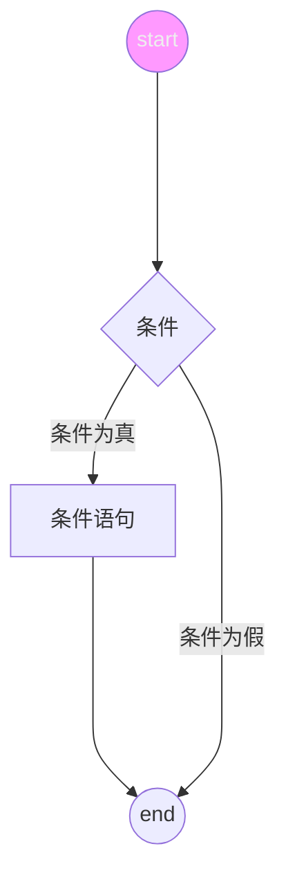

# lua

## 注释

```lua
-- 单行注释

--[[
多行注释
多行注释
--]]
```

## 关键词

|   and    | break |  do   |  else  |
| :------: | :---: | :---: | :----: |
|  elseif  |  end  | false |  for   |
| function |  if   |  in   | local  |
|   nil    |  not  |  or   | repeat |
|  return  | then  | true  | until  |
|  while   | goto  |       |        |

一般约定，以下划线开头连接一串大写字母的名称（比如\_VERSION）被保留用于Lua内部的全局变量。

## 全局变量

在默认情况下，变量总是认为是全局的。

全局变量不需要声明，给一个变量赋值后即创建了这个全局变量，访问一个没有初始化的全局变量也不会出错，只不过得到的结果是：`nil`

```shell
> print(b)
nil
> b=10
> print(b)
10
```

如果要删除一个全局变量，只需要将变量赋值为`nil`。

## Lua数据类型

Lua 是动态类型语言，变量不要类型定义，只需要为变量赋值。
| 数据类型 | 描述 |
|--------------- | --------------- |
| nil | 表示一个无效值，在条件表达式中相当于false |
| boolean | false or true |
| number | 双精度类型的实浮点数 |
|string | 字符串由一对双引号或单引号表示 |
|function|由c或lua编写的函数|
|userdata|表示任意存储在变量中的c数据结构|
|thread|表示执行的独立线路，用于执行协同程序|
|table|一个关联数组，数组的索引可以是数字、字符串或表类型，用{}创建一个空表|

## Lua变量

Lua 变量有三种类型：全局变量、局部变量、表中的域。
Lua 中的变量全是全局变量，哪怕是语句块或函数里，除非用`local`显示声明为局部变量。
局部变量的作用域从声明位置开始到所在语句块结束。

### 赋值语句

Lua 可以对多个变量同时赋值。

```lua
a, b = 10, 'hello';
```

Lua 会先计算右边所有的值再进行赋值操作，所有可以这样交换变量的值：

```lua
x, y = y, x;
a[i], a[j] = a[j], a[i];
```

当变量个数的值的个数不一致时，Lua 会一直以变量的个数为基础采用策略：

1. 变量个数 > 值的个数 按变量个数补足nil
2. 值的个数 > 变量个数 多余的值会被忽略

函数可以返回多个值

```lua
-- func返回两个值，第一个赋值给a，第二个赋值给b
a, b = func()

```

应该尽可能地使用局部变量，既可以避免命名冲突，又可以加快访问的速度。

## Lua 循环



### while

```lua
while(condition)
do
  statements
end
```

### for

Lua 中for循环有两大类，数值for循环和泛型for循环

#### 数值for循环

```lua
-- var从exp1变化到exp2，步长为exp3，并执行一次执行体。exp3可选，如果不指定，默认为1。
for var=exp1,exp2,exp3 do
  <执行体>
end
```

#### 泛型for循环

泛型for循环通过一个迭代器函数来遍历所有值，类似java中的foreach

```lua
-- 打印数组a的所有值
-- i是数组索引，v是对应索引的数组元素值
a = {"a", "b", "c"}
for i, v in ipairs(a) do
  print(i, v)
end
```

### break & goto

break退出当前循环。

goto语句允许将控制流程无条件地转到被标记的语句处。

```lua
goto lable
```

Lable 的格式为：

```lua
:: Lable ::
```

使用

```lua
local a = 1
:: lable :: print("-- goto lable --")

a = a + 1
if a < 3 then
  goto lable
end
```

## Lua 流程控制



控制结果的条件表达式结果可以是任何值。Lua 认为false和nil为假，true和非nil为真。
要注意Lua 中的0为true。

```lua
if(condition)
then
  -- condition is true
else
  condition is false
end
```

```lua
if(condition1)
then
  -- condition1 is true
elseif(condition2)
then
  -- condition2 is true
else
  -- condition1 and condition2 both false
end
```

## Lua 函数

Lua 函数定义格式：

```lua
--[[
optional_function_scope: 该参数是可选的，指定函数为全局函数还是局部函数，未设置默认为全局函数。
result_params_comma_spearated: 函数返回值，Lua 函数可以返回多个值，每个值以逗号隔开。
--]]
optional_function_scope function function_name(arg1, arg2, arg3..., argn)
  function_body
  return result_params_comma_spearated
end
```

### 可变参数

Lua 函数可以接受可变数目的参数，和C语言类似，在函数参数列表中使用三点`...`表示函数有可变的参数。

```lua
function add(...)
 local s = 0
 for index, value in ipairs({ ... }) 2024-04-24T01:03:26
  s = s + value
 end
 return s
end

print(add(1, 2, 3, 34, 5, 6))
```

可以使用`select("#", ...)`来获取可变参数的数量。

## Lua 运算符

### 算术运算符

| 操作符 | 描述     |
| ------ | -------- |
| +      | 加法     |
| -      | 减法     |
| \*     | 乘法     |
| /      | 除法     |
| %      | 取余     |
| ^      | 乘幂     |
| -      | 负号     |
| //     | 整除运算 |

### 关系运算符

| 操作符 | 描述                     |
| ------ | ------------------------ |
| ==     | 等于，检测两个值是否相等 |
| ~=     | 不等于                   |
| >      | 大于                     |
| <      | 小于                     |
| >=     | 大于等于                 |
| <=     | 小于等于                 |

### 逻辑运算符

| 操作符 | 描述   |
| ------ | ------ |
| and    | 逻辑与 |
| or     | 逻辑或 |
| not    | 逻辑非 |

### 其他运算符

| 操作符 | 描述                 |
| ------ | -------------------- |
| ..     | 连接两个字符串       |
| #      | 返回字符串或表的长度 |
