# 机器学习

Machine Learning 约等于 Looking for Function。

## Different types of Functions

- Regression: The function outputs a scalar.
- Classification:Given options(classes),the function outputs a correct one.
- Structured Learning: create someting with structure.

1. Function with unknown parameters **[$y = wx + b$]**
2. Define a loss function from training data **[$L(b, w)$]**
3. Optimization: find the parameters that minimize the loss function **[$argmin_{b,w} L(b, w)$]**

## gradient descent

梯度下降

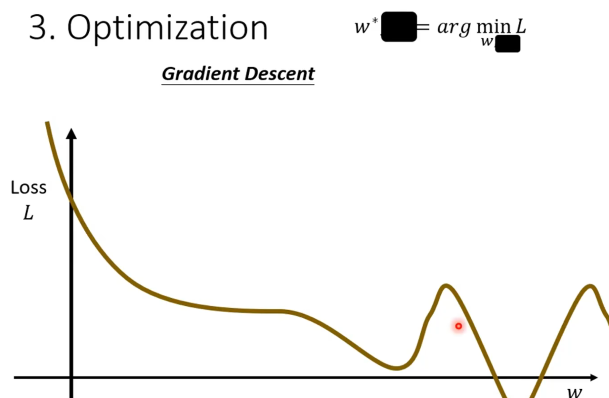

1. (randomly) Pick an initial point **[$w^0$]**
2. Compute $\partial L / \partial w |_{w=w^0}$
3. 如果计算的偏微分为负， 则增大 w, 如果为正，则减小 w

hyperparameters: 在优化过程中，需要自己设置调整的参数，比如学习率，学习步长等。

bias：偏差
piecewise：分段的
curves: 曲线的

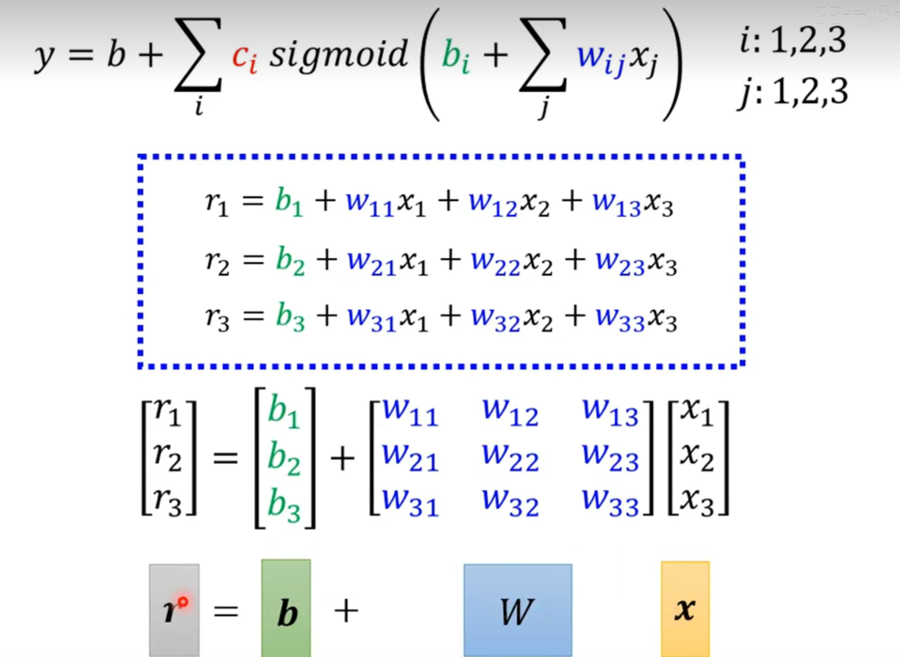
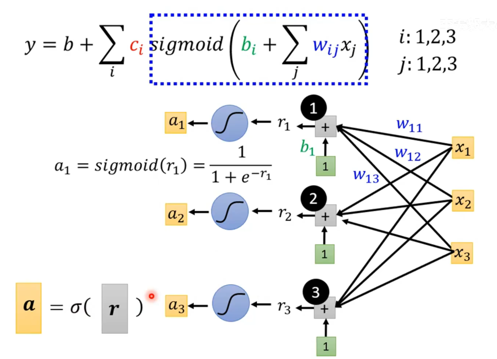
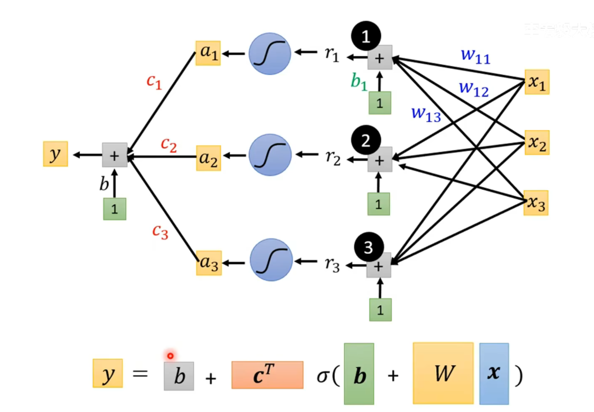
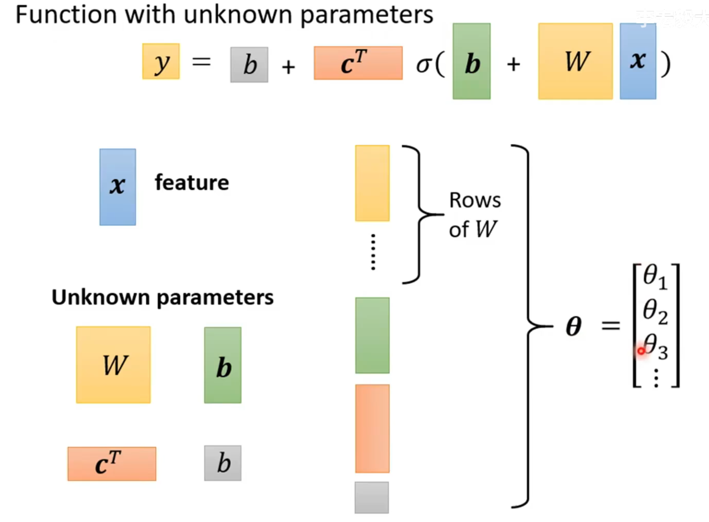

batch: 批量
epoch: 把所有批次的数据全部训练一次就叫一次epoch。

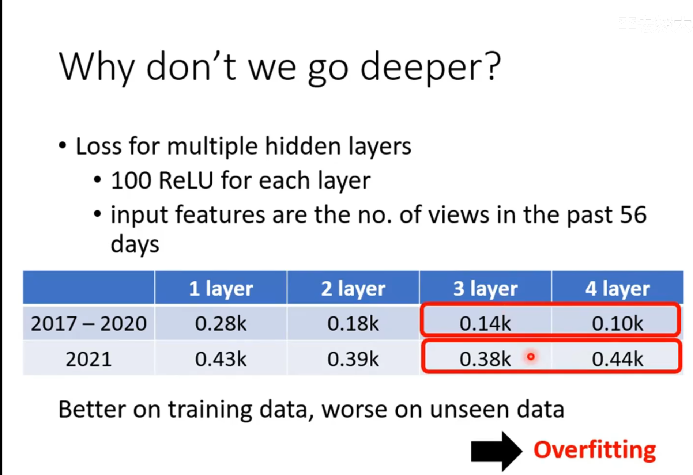

## 神经网络

### create neuron network

```python

import torch.nn as nn

class MyModel(nn.Module):
    def __init__(self):
        super(MyModel, self).__init__()
        self.net = nn.Sequential(
            nn.Linear(10, 32)
            nn.sigmoid()
            nn.Linear(32, 1)
        )
    
    # 定义前向传播过程
    def forward(self, x):
        return self.net(x)
```

### loss function

损失函数用于衡量模型的预期值和真实值之间的差异。

常见的损失函数包括：

- 均方误差（MSELoss）：回归问题常用，计算输出和目标值的平方差
- 交叉熵损失（CrossEntropyLoss）：分类问题常用，计算输出和真实标签之间的交叉熵
- BCEWithLogitsLoss：二分类问题，结合了 Sigmoid 激活和二元交叉熵损失。

```python
criterion = nn.MSELoss()
```

### 激活函数

激活函数负责将神经元的输入映射到输出端，它们将非线性的特性引入到神经元中。如果没有矩阵相乘，没有激活函数的神经网络叠加了若干层之后，还是一个线性变化，与单层感知无异。

激活函数分为饱和激活函数和不饱和激活函数，激活函数的右饱和是指当 x 趋向正无穷时，函数的导数趋近于 0 。同样当 x 趋向负无穷时，函数的导数趋近于 0 则称为左饱和。当一个激活函数既满足左饱和又满足右饱和时为饱和函数。否则称为非饱和函数。

#### Sigmoid 函数

Sigmoid 函数是一个 S 型生长曲线，由于其单增以及反函数单增等性质，Sigmoid 函数被作为神经网络的激活函数。将变量映射到 [0,1] 之间。

$$
    y = c \ \frac{1}{1 + e^{-(b + wx_1)}}
    = c \ sigmoid(b + wx_1)
$$

对于分段函数

$$
    y = b + \sum_i c_i \ sigmoid(b_i  + w_i x_i)
$$

Sigmoid 函数的特点

- Sigmoid 函数的输出范围是 [0, 1]。输出值限定在 0 到 1，因此可以对每个神经元的输出做归一化。
- 用于将预测的概率作为输出的模型
- 梯度平滑，避免跳跃的输出值
- 函数可微分
- 函数不是以 0 为中心，这回降低权重更新的效率
- Sigmoid 函数执行指数运算，计算速度慢

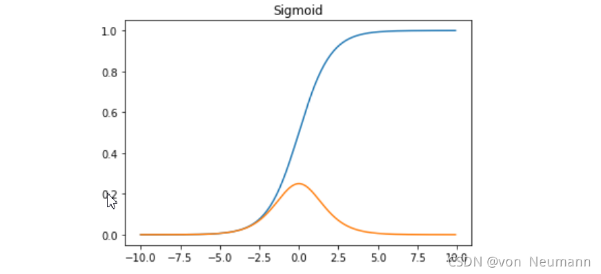

#### Tanh 双曲正切函数

双曲正切函数是双曲函数的一种，写作 tanh 。该函数解决了 Sigmoid 函数不以 0 为中心的输出问题。然而梯度消失和幂运算的问题依然存在。

$$
    tanh(x) = \frac{e^x - e^{-x}}{e^x + e^{-x}}
$$

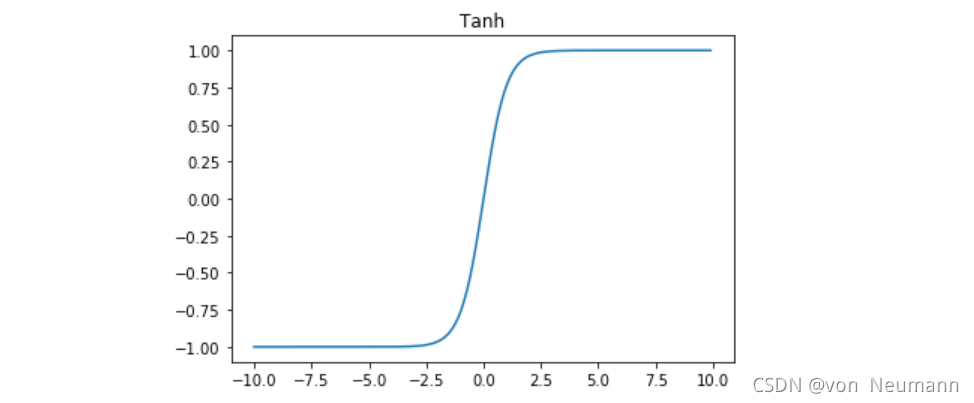

#### ReLU 线性整流函数

$$
    ReLU(x) = max(0, x)
$$

线性整流函数(ReLU 函数)的特点：

- 当输出为正时，不存在梯度饱和问题
- 计算的速度快得多。ReLU 函数只存在线性关系，因此计算速度比 Sigmoid 函数和 tanh 函数更快
- Dead ReLu 会有问题。当输入为负数时， RuLU 完全失效，在正向传播的过程中，这不是问题。有些区域敏感有些不敏感。但是在反向传播的过程中，如果输入为负，则梯度则完全为零，Sigmoid 函数和 tanh 函数也具有相同的问题
- ReLU 函数的输出为 0 或整数，这意味着 ReLU 函数不是以 0 为中心的函数

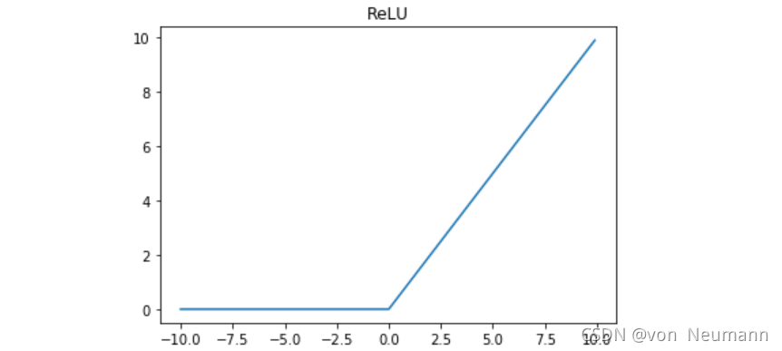

#### Leaky ReLU 函数

Leaky ReLU 函数是一种专门设计用于解决 Dead ReLU 问题的激活函数

$$
    LeakyReLU(x) =
    \begin{cases}
        x   ,\quad x > 0 \\
        ax  ,\quad x \leq 0
    \end{cases}
$$

- Leaky ReLU 解决了 ReLU 输入值为负值时神经元的死亡问题，
- 函数中的 α 需要有先验经验人工赋值（一般设为 0.01）
- 有些近似线性，导致在复杂分类中的效果并不好

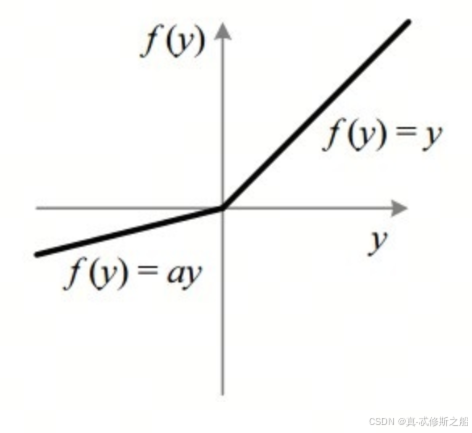

#### ELU 函数

ELU 的提出也解决了 ReLu 的问题。

$$
    ELU_{(x)} =
    \begin{cases}
        x,    \quad x > 0 \\
        α(e^x - 1), \quad x \leq 0

    \end{cases}
$$

- ELU 函数存在幂运算，计算强度较高
- 在实践中相较于 ReLU 没有更好的效果，故应用不多

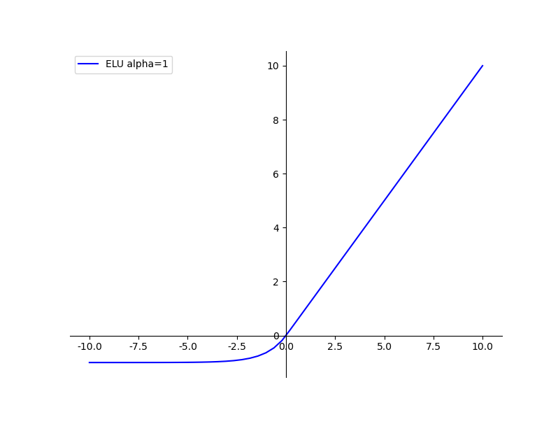

#### PReLU 函数

$$
    P ReLU(x) =
    \begin{cases}
        x, \quad x > 0 \\
        a_ix, \quad x \leq 0
    \end{cases}
$$

- 在负值域 ，PReLU 的斜率较小，避免了 DeadReLU 问题
- 与 ELU 相比，PReLU 在负值域是线性运算，尽管斜率很小，但不会趋于 0

#### Softmax 函数

Softmax 函数是用于多类分类问题的激活函数，在多分类问题中，超过两个类标签需要类成员关系。对于长度为 K 的任意实向量，Softmax 函数可以将其压缩为长度为 K，值在 [0, 1] 范围内，并且向量中元素的总和为 1 的实向量。

$$
    Softmax(x) = \frac{e^{x_i}}{\sum_i e^{x_i} }
$$

#### Swish 函数

$$
    Swish(x) = x * Sigmoid(x)
$$

Swith 的特点：

- 有助于防止慢速训练期间，梯度逐渐接近 0 并导致饱和
- 导数恒大于 0
- 平滑度在优化和泛化中起到了重要的作用

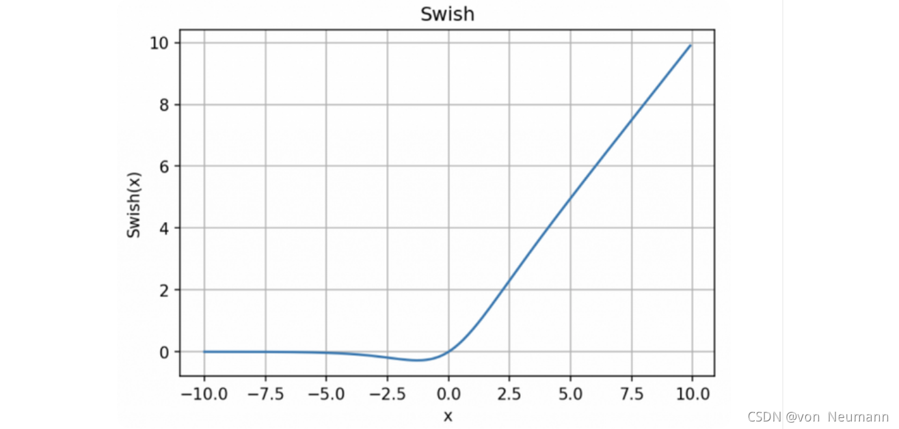

#### Maxout 函数

Maxout 可以看作是在深度学习网络层中加入一层激活函数层，包含一个参数 k，这一层相比较 ReLU，Sigmoid 等，其特殊之处在于增加了 k 个神经元，然后输出激活值最大的值。

#### Softplus

Softplus 函数可以看作是 ReLU 函数的平滑。

$$
    Softplus(x) = log(1 + e^x)
$$

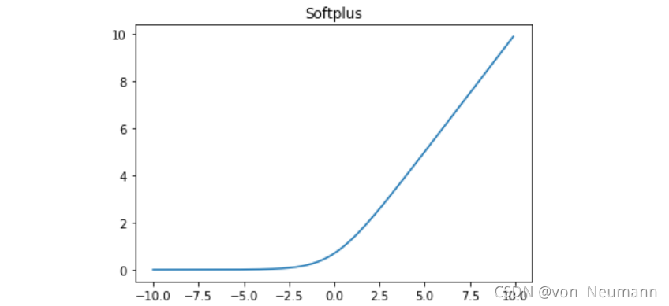

#### Softsign 函数

Softsign 函数是 tanh 函数的另一个替代选择。就像 Tanh 一样，Softsign 函数是反对称、去中心、可微分，并返回 -1 到 1 之间的值。曲线更平坦，导数下降更缓慢。比 tanh 更好地解决了梯度消失的问题。另一方面 Softsign 导数的计算比 tanh 函数的更麻烦。

$$
    Softsign = \frac{x}{1 + \mid x \mid} \\
    Softsign'(x) = \frac{1}{(1 + \mid x \mid)^2}
$$

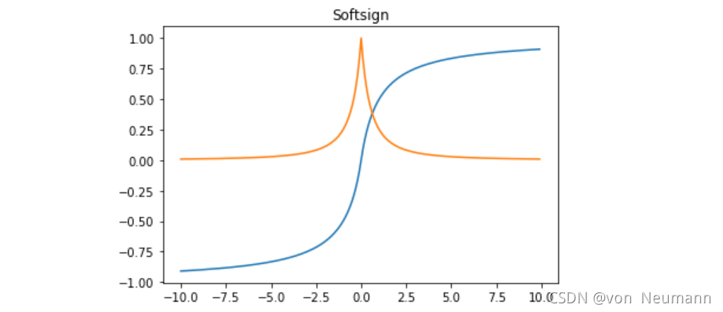

#### GELU 高斯误差线性单元

GELU 与 Swish 激活函数的函数形式和函数性质非常相似，一个是固定的系数 1.702，另一个是可变的系数 β，两者的实际应用相差不大。

### optimizer

优化器用于调整模型的参数，以使得损失函数的值最小化。常见的优化器包括：

- SGD：随机梯度下降，更新参数的梯度
- Adam：Adaptive Moment Estimation，自适应的动量估计，常用于深度学习。

## 反向传播

Backpropagation

### Chain Rule

链式法则

- case1

$$
    y = g(x) \quad z = h(y)\tag{1} \\
    \Delta x \to \Delta y \to \Delta z \\
    \frac{dz}{dx} = \frac{dz}{dy}\frac{dy}{dx}
$$

- case2

$$
    x = g(s) \quad y=h(s) \quad z=h(x,y) \\
    \frac{dz}{ds} = \frac{\partial z}{\partial x}\frac{d x}{d s} + \frac{\partial z}{\partial y}\frac{d y}{d  s}
$$

### 传播

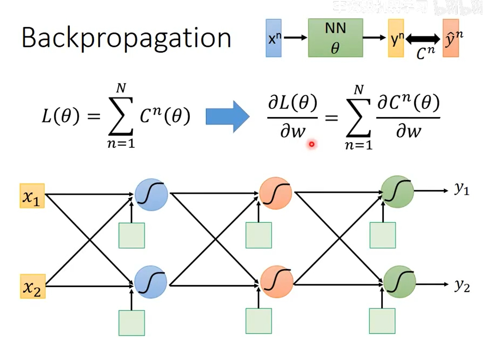

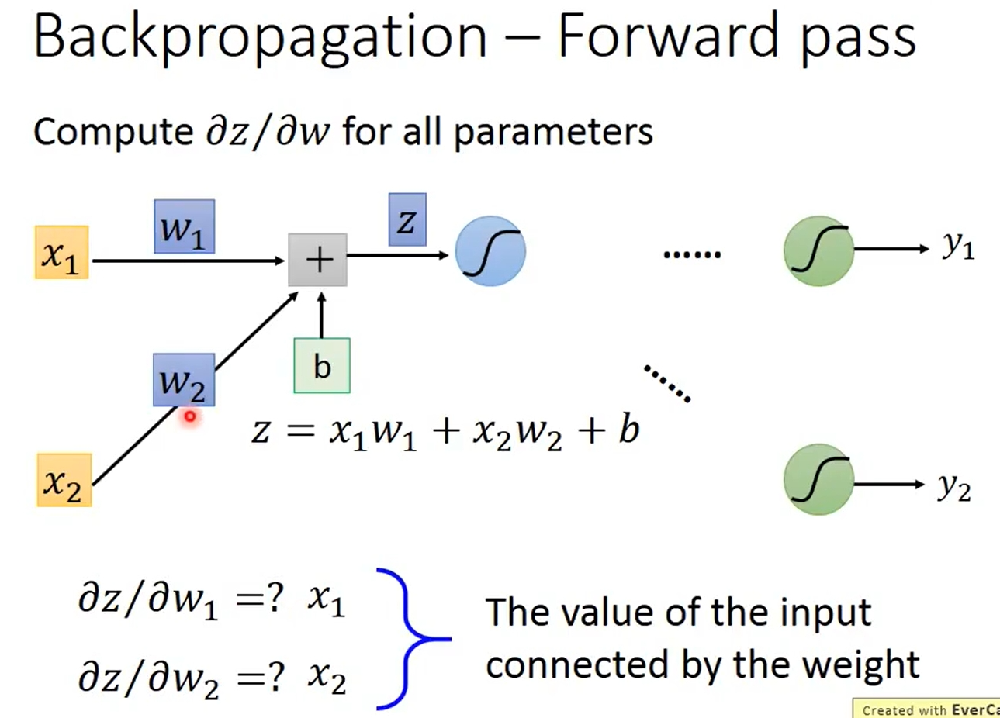

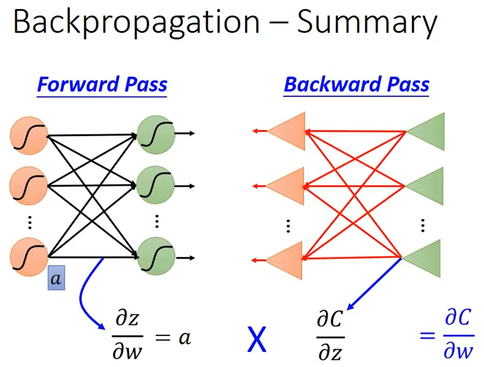

## regression

### Logistic Regression

逻辑回归是一种用于解决二分类问题的回归分析方法。通常用于分类和预测模型。

$$
    f_{w,b}(x) = \sigma\Big(\sum_i w_ix_i + b \Big)
$$

output: between 0 and 1

线性回归

$$
    f_{w,b}(x) = \sum_i w_ix_i + b
$$

output: any value

#### 极大似然估计

极大似然估计是建立在极大似然原理的基础上的一个统计方法，是概率论在统计学上的应用。

极大似然估计提供了一种给定观察数据来评估模型的参数，即：
“模型已定，参数未知”。通过若干次实现，观察其结果，**利用实验结果得到某个参数值能够是样本出现的概率最大**，则称为最大似然估计。

#### 逻辑回归的问题

逻辑回归基本上只能用于二分类的问题

### Model Bias v.s. Optimization Issue


if deeper networks don't obtain smaller loss on **training data**,then there is optimization issue.

## 如何完成一个机器学习攻略

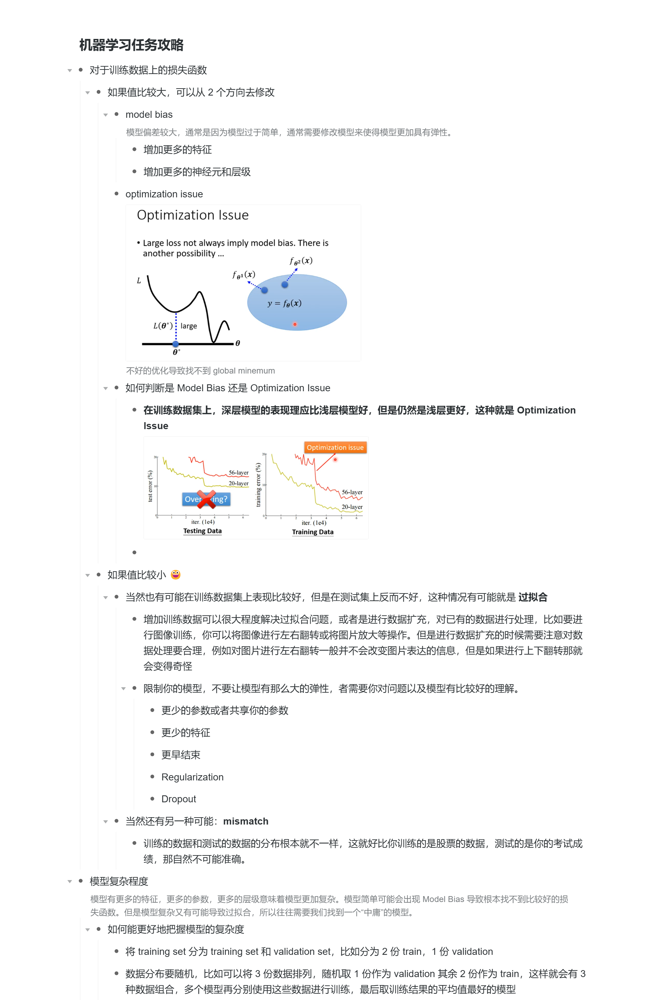

### 类神经网络训练不起来怎么办

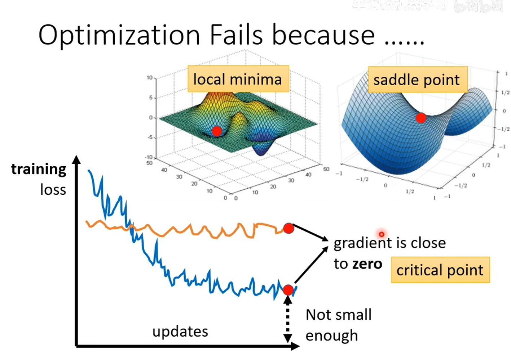

梯度丢失（梯度接近于 0）

#### 那如何知道是 局部最低点 还是 鞍点 呢

一个具有高维度空间的函数，如果梯度为0，那么再每个方向上，它可能是凸函数也有可能是凹函数。那么想要找到局部最低点就意味这每一个维度的曲线都得向上弯曲，这发生的几率很小。这也意味着，在高维空间中，更有可能碰到的是**鞍点**而不是局部最低点。

那么如何区分鞍点和局部最优呢？这就需要用到神经网络的 `loss surface` 的 `Hessian` 矩阵，通过计算 `Hession` 矩阵的特征值，就可以确定神经网络的解属于哪种类型：

- 当 `Hessian` 矩阵的特征值有正有负的时候，神经网络的一阶导数为 0 的点为鞍点
- 当 `Hessian` 矩阵的特征值全部为非负的时候，神经网络的一阶导数为 0 的点为局部极小值点。

##### 从 Loss 中如何判断是鞍点还是局部最小值困扰优化

- 当 `Loss` 很大的时候，特征值分布有正有负，表明鞍点是困扰优化的主要原因
- 当 `Loss` 很小的时候，鞍点逐渐消失，系统中主要就是局部极小值了

### Small Batch v.s. Large Batch

|| Small | Large |
| :--- | --- | --- |
| Speed for one update (no parallel) | Faster | Slower |
| Speed for one update (with parallel) | Same | Same (not too large) |
| Time for one epoch | Slower | Faster |
| Gradient | Noisy | Stable |
| Optimization | Better | Worse |
| Generalization | Better | Worse |

### Momentum

Gradient Descent + Momentum

Movement: movement of last step minus gradient at present.

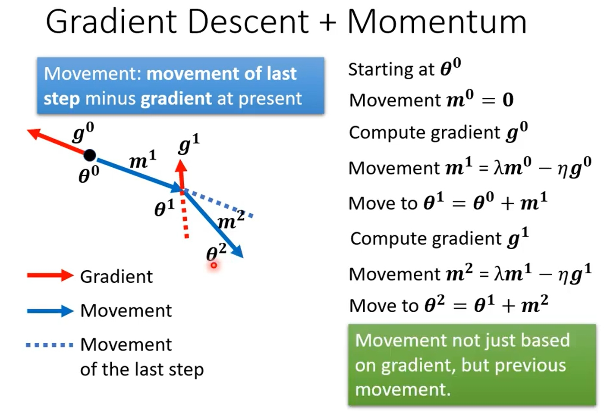

加上 momentum 之后可以解决一些原本梯度消失的问题。

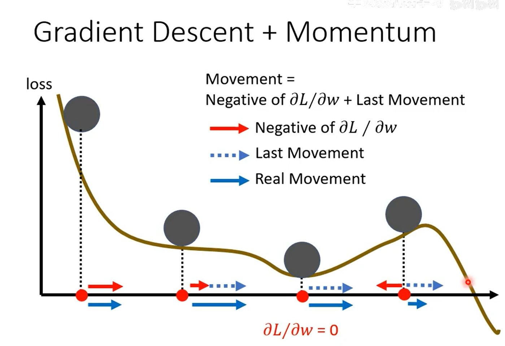

### learning rate

之前都是给所有的参数设置相同的 learning rate，但是大的 learning rate 可能会导致参数修改的步子太大而不能到达最优点（就像在山谷的两侧崖壁上来回移动而到达不了山谷的最低点），过小的 learing rate 又会导致移动的步子太小导致几乎不能到达最优点。

**因此，参数的 learning rate 不能一视同仁**

#### 如何自动修改 learning rate

- 如果在一个方向上非常的平坦，那么 learning rate 就可以大一点
- 如果在一个方向上非常的陡峭，那么 learning rate 就要小一点

### 损失函数

Cross Entropy 函数在 pytorch 中已经内涵了 softmax 函数。

## 卷积神经网络

Convolutional Neural Network (CNN)

卷积神经网络是专门用于处理图像数据的神经网络。它由卷积层、池化层和全连接层组成。

一张图片在计算机中都由 3 个维度组成，长、宽、以及颜色通道(RGB)

### benifit of convolutional layer

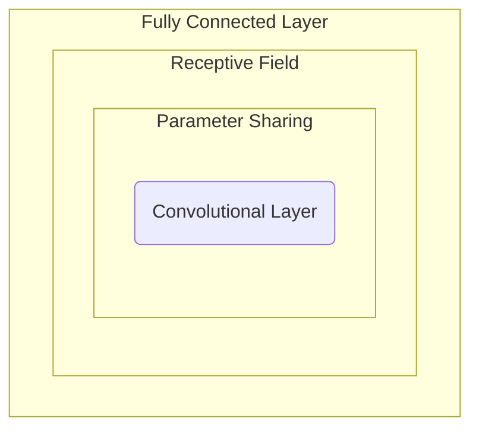
```mermaid
graph TB
subgraph Fully Connected Layer
    subgraph Receptive Field
        subgraph Parameter Sharing
            s(Convolutional Layer)
        end
    end
end
```

- Some patterns are much smaller than whole imgae.
- The same patterns appear in different regions.

### pooling

pooling 做的事就是把图片变小。

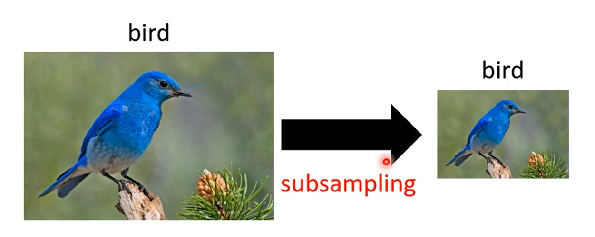

通过观察，把一张大的图片的偶数的行，奇数的列拿掉，图片变成原来的四分之一，但是并不会影响图片的表达。

### whole CNN

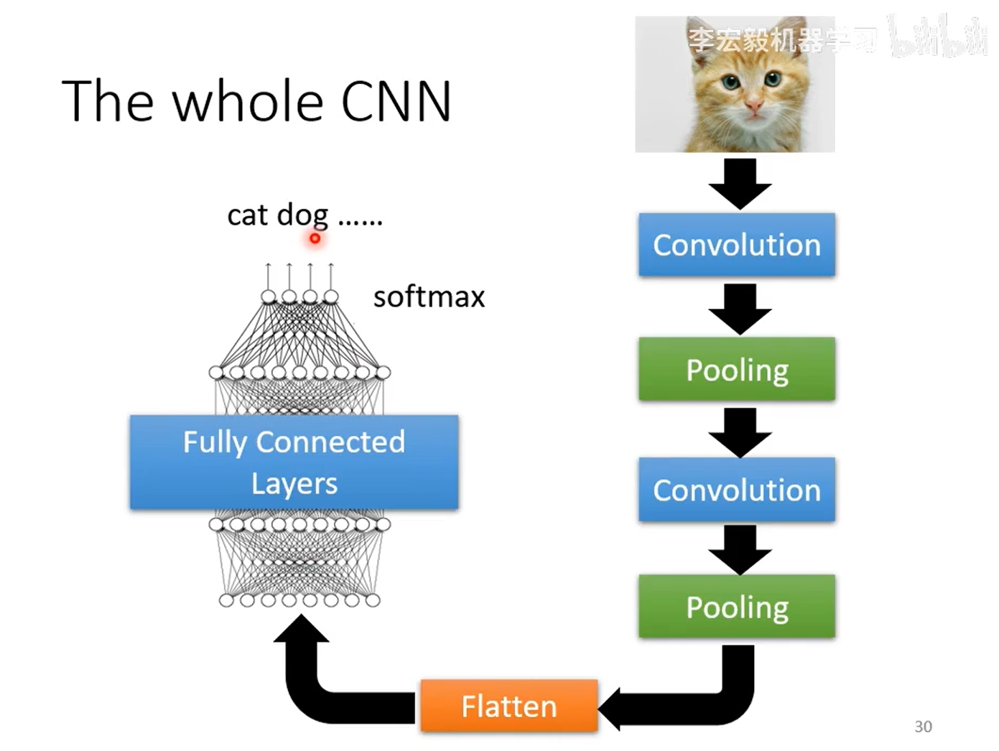

所以一个完整的卷积神经网络模型可能是多次的卷积层和池化层后，接一个 Flatten 函数（将多维的张量压缩为一维，通常用在卷积层到全连接层的过渡），最后跟上全连接层和 softmax 来进行分类。

### 卷积核

卷积核是卷积神经网络中的核心，它相当于一个滤波器，用来提取图像中的特征，所以有些文档也会把卷积核称为 filter。

卷积核在形式上是一个矩阵，通常是3x3，5x5，7x7等（奇数 * 奇数，奇数的卷积核更容易找到中心）。

### padding

如果只对当前图像中的数据进行卷积运算，那么图像边缘位置的数据就只能参与一次卷积运算，而图像中央的数据可以参与多次卷积运算，这会可能导致图像边缘的信息丢失。

因此引入 padding 来解决这个问题。padding 的作用就是为图像边缘添加一些空白，使得图像边缘的数据也能参与卷积运算。padding 为 1 的话，就相当于在图像周围（上下左右）各添加了 1 个像素，如果为 2 的话，通常填充的数据为 0。

### stride

stride 的作用就是控制卷积核滑动的步长，默认为 1。步长会影响卷积图的大小，步长越大，卷积图越小。

### in_channel 和 out_channel

如果是第一个卷积层，那么彩色图像的 in_channel 是 3，黑白图像的 in_channel 是 1。out_channel 对应的是卷积核的数量。

### feature map

feature map 是卷积操作的输出，由卷积核 和 输入图像对应大小的位置的矩阵对应位置相乘再相加组成。

feature map 的大小由卷积核的大小、步长、图像的大小决定。

$$
    \text{out} = floor(\frac{\text{in} - \text{kernel} + 2 \times \text{padding}} {\text{stride}}) + 1
$$
