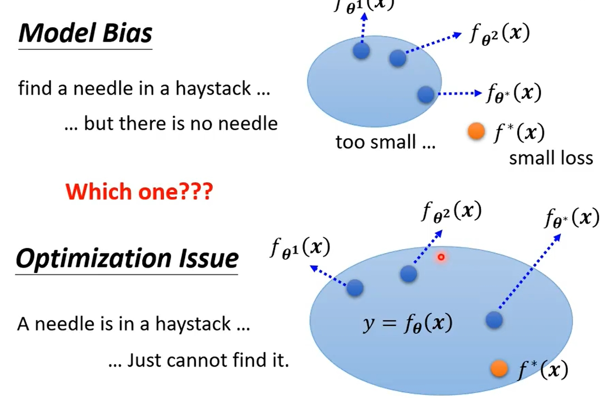

# 机器学习

Machine Learning 约等于 Looking for Function。

## Different types of Functions

- Regression: The function outputs a scalar.
- Classification:Given options(classes),the function outputs a correct one.
- Structured Learning: create someting with structure.

1. Function with unknown parameters **[$y = wx + b$]**
2. Define a loss function from training data **[$L(b, w)$]**
3. Optimization: find the parameters that minimize the loss function **[$argmin_{b,w} L(b, w)$]**

## gradient descent

梯度下降


1. (randomly) Pick an initial point **[$w^0$]**
2. Compute $\partial L / \partial w |_{w=w^0}$
3. 如果计算的偏微分为负， 则增大 w, 如果为正，则减小 w

hyperparameters: 在优化过程中，需要自己设置调整的参数，比如学习率，学习步长等。

bias：偏差
piecewise：分段的
curves: 曲线的


batch: 批量
epoch: 把所有批次的数据全部训练一次就叫一次epoch。


## 神经网络

### create neuron network

```python

import torch.nn as nn

class MyModel(nn.Module):
    def __init__(self):
        super(MyModel, self).__init__()
        self.net = nn.Sequential(
            nn.Linear(10, 32)
            nn.sigmoid()
            nn.Linear(32, 1)
        )
    
    # 定义前向传播过程
    def forward(self, x):
        return self.net(x)
```

### loss function

损失函数用于衡量模型的预期值和真实值之间的差异。

常见的损失函数包括：

- 均方误差（MSELoss）：回归问题常用，计算输出和目标值的平方差
- 交叉熵损失（CrossEntropyLoss）：分类问题常用，计算输出和真实标签之间的交叉熵
- BCEWithLogitsLoss：二分类问题，结合了 Sigmoid 激活和二元交叉熵损失。

```python
criterion = nn.MSELoss()
```

### 激活函数

激活函数负责将神经元的输入映射到输出端，它们将非线性的特性引入到神经元中。如果没有矩阵相乘，没有激活函数的神经网络叠加了若干层之后，还是一个线性变化，与单层感知无异。

激活函数分为饱和激活函数和不饱和激活函数，激活函数的右饱和是指当 x 趋向正无穷时，函数的导数趋近于 0 。同样当 x 趋向负无穷时，函数的导数趋近于 0 则称为左饱和。当一个激活函数既满足左饱和又满足右饱和时为饱和函数。否则称为非饱和函数。

#### Sigmoid 函数

Sigmoid 函数是一个 S 型生长曲线，由于其单增以及反函数单增等性质，Sigmoid 函数被作为神经网络的激活函数。将变量映射到 [0,1] 之间。

$$
    y = c \ \frac{1}{1 + e^{-(b + wx_1)}}
    = c \ sigmoid(b + wx_1)
$$

对于分段函数

$$
    y = b + \sum_i c_i \ sigmoid(b_i  + w_i x_i)
$$

Sigmoid 函数的特点

- Sigmoid 函数的输出范围是 [0, 1]。输出值限定在 0 到 1，因此可以对每个神经元的输出做归一化。
- 用于将预测的概率作为输出的模型
- 梯度平滑，避免跳跃的输出值
- 函数可微分
- 函数不是以 0 为中心，这回降低权重更新的效率
- Sigmoid 函数执行指数运算，计算速度慢


#### Tanh 双曲正切函数

双曲正切函数是双曲函数的一种，写作 tanh 。该函数解决了 Sigmoid 函数不以 0 为中心的输出问题。然而梯度消失和幂运算的问题依然存在。

$$
    tanh(x) = \frac{e^x - e^{-x}}{e^x + e^{-x}}
$$


#### ReLU 线性整流函数

$$
    ReLU(x) = max(0, x)
$$

线性整流函数(ReLU 函数)的特点：

- 当输出为正时，不存在梯度饱和问题
- 计算的速度快得多。ReLU 函数只存在线性关系，因此计算速度比 Sigmoid 函数和 tanh 函数更快
- Dead ReLu 会有问题。当输入为负数时， RuLU 完全失效，在正向传播的过程中，这不是问题。有些区域敏感有些不敏感。但是在反向传播的过程中，如果输入为负，则梯度则完全为零，Sigmoid 函数和 tanh 函数也具有相同的问题
- ReLU 函数的输出为 0 或整数，这意味着 ReLU 函数不是以 0 为中心的函数


#### Leaky ReLU 函数

Leaky ReLU 函数是一种专门设计用于解决 Dead ReLU 问题的激活函数

$$
    LeakyReLU(x) = 
    \begin{cases}
        x   ,\quad x > 0 \\
        ax  ,\quad x \leq 0
    \end{cases}
$$

- Leaky ReLU 解决了 ReLU 输入值为负值时神经元的死亡问题，
- 函数中的 α 需要有先验经验人工赋值（一般设为 0.01）
- 有些近似线性，导致在复杂分类中的效果并不好


#### ELU 函数

ELU 的提出也解决了 ReLu 的问题。

$$
    ELU_{(x)} = 
    \begin{cases}
        x,    \quad x > 0 \\
        α(e^x - 1), \quad x \leq 0
        
    \end{cases}
$$

- ELU 函数存在幂运算，计算强度较高
- 在实践中相较于 ReLU 没有更好的效果，故应用不多


#### PReLU 函数

$$
    P ReLU(x) = 
    \begin{cases}
        x, \quad x > 0 \\
        a_ix, \quad x \leq 0
    \end{cases}
$$

- 在负值域 ，PReLU 的斜率较小，避免了 DeadReLU 问题
- 与 ELU 相比，PReLU 在负值域是线性运算，尽管斜率很小，但不会趋于 0 

#### Softmax 函数

Softmax 函数是用于多类分类问题的激活函数，在多分类问题中，超过两个类标签需要类成员关系。对于长度为 K 的任意实向量，Softmax 函数可以将其压缩为长度为 K，值在 [0, 1] 范围内，并且向量中元素的总和为 1 的实向量。

$$
    Softmax(x) = \frac{e^{x_i}}{\sum_i e^{x_i} }
$$

#### Swish 函数

$$
    Swish(x) = x * Sigmoid(x)
$$

Swith 的特点：

- 有助于防止慢速训练期间，梯度逐渐接近 0 并导致饱和
- 导数恒大于 0
- 平滑度在优化和泛化中起到了重要的作用


#### Maxout 函数

Maxout 可以看作是在深度学习网络层中加入一层激活函数层，包含一个参数 k，这一层相比较 ReLU，Sigmoid 等，其特殊之处在于增加了 k 个神经元，然后输出激活值最大的值。

#### Softplus

Softplus 函数可以看作是 ReLU 函数的平滑。

$$
    Softplus(x) = log(1 + e^x)
$$


#### Softsign 函数

Softsign 函数是 tanh 函数的另一个替代选择。就像 Tanh 一样，Softsign 函数是反对称、去中心、可微分，并返回 -1 到 1 之间的值。曲线更平坦，导数下降更缓慢。比 tanh 更好地解决了梯度消失的问题。另一方面 Softsign 导数的计算比 tanh 函数的更麻烦。

$$
    Softsign = \frac{x}{1 + \mid x \mid} \\
    Softsign'(x) = \frac{1}{(1 + \mid x \mid)^2}
$$


#### GELU 高斯误差线性单元

GELU 与 Swish 激活函数的函数形式和函数性质非常相似，一个是固定的系数 1.702，另一个是可变的系数 β，两者的实际应用相差不大。

### optimizer

优化器用于调整模型的参数，以使得损失函数的值最小化。常见的优化器包括：

- SGD：随机梯度下降，更新参数的梯度
- Adam：Adaptive Moment Estimation，自适应的动量估计，常用于深度学习。


## 反向传播

Backpropagation

### Chain Rule

链式法则

- case1

$$
    y = g(x) \quad z = h(y)\tag{1} \\
    \Delta x \to \Delta y \to \Delta z \\
    \frac{dz}{dx} = \frac{dz}{dy}\frac{dy}{dx}    
$$

- case2

$$
    x = g(s) \quad y=h(s) \quad z=h(x,y) \\
    \frac{dz}{ds} = \frac{\partial z}{\partial x}\frac{d x}{d s} + \frac{\partial z}{\partial y}\frac{d y}{d  s} 
$$

### 传播


## regression

### Logistic Regression

逻辑回归是一种用于解决二分类问题的回归分析方法。通常用于分类和预测模型。

$$
    f_{w,b}(x) = \sigma\Big(\sum_i w_ix_i + b \Big)
$$

output: between 0 and 1

线性回归

$$
    f_{w,b}(x) = \sum_i w_ix_i + b
$$

output: any value

#### 极大似然估计

极大似然估计是建立在极大似然原理的基础上的一个统计方法，是概率论在统计学上的应用。

极大似然估计提供了一种给定观察数据来评估模型的参数，即：
“模型已定，参数未知”。通过若干次实现，观察其结果，**利用实验结果得到某个参数值能够是样本出现的概率最大**，则称为最大似然估计。

#### 逻辑回归的问题

逻辑回归基本上只能用于二分类的问题

### Model Bias v.s. Optimization Issue



if deeper networks don't obtain smaller loss on **training data**,then there is optimization issue.

