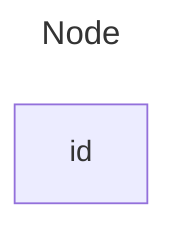
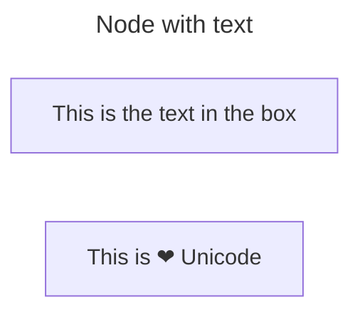
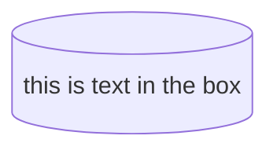
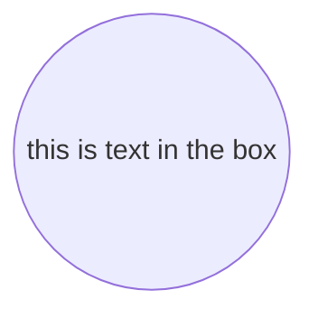
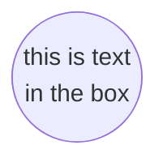
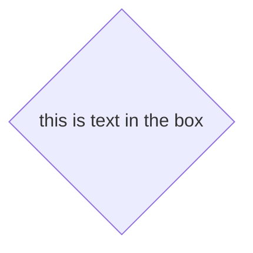
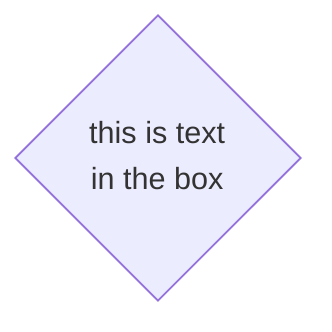
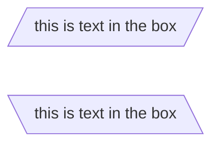

# mermaid

## 流程图

### 默认节点



### 带有文本的节点



### 方向

| 符号 | 意义     |
| ---- | -------- |
| TB   | 从上而下 |
| BT   | 从下而上 |
| LR   | 从左往右 |
| RL   | 从右往左 |

### 节点形状

#### 圆边节点

````mark

````


#### 体育场节点

````mark

````


#### 子程序节点

````mark

````


#### 圆柱节点

````mark

````


#### 圆形节点

````mark

````



#### 标签节点

````mark

````


#### 菱形节点

````mark

````



#### 六边形节点

````mark

````


#### 平行四边形节点

````mark

````


#### 梯形节点

````mark
```mermaid
flowchart LR
    id[/this is text in the box\]
    id1[\this is text in the box/]
```
````

```mermaid
flowchart LR
    id[/this is text in the box\]
    id1[\this is text in the box/]
```

#### 双圈节点

````mark
```mermaid
flowchart LR
    id(((this is text in the box)))
```
````

```mermaid
flowchart LR
    id(((this is text
    in the box)))
```

### 节点之间的连接

#### 带箭头的连接

````mark
```mermaid
flowchart LR
    A-->B
```
````

```mermaid
flowchart LR
    A-->B
```

#### 无箭头的连接

````mark
```mermaid
flowchart LR
    A---B
```
````

```mermaid
flowchart LR
    A---B
```

#### 连接上的文本

````mark
```mermaid
flowchart LR
    A---|this is the text|B
```
````

```mermaid
flowchart LR
    A---|this is the text|B
```

#### 虚线连接

````mark
```mermaid
flowchart LR
    A-.-B
```
````

```mermaid
flowchart LR
    A-.-B
    B-.->|this is the text|C
```

#### 粗连接

````mark
```mermaid
flowchart LR
    A===B==>C
```
````

```mermaid
flowchart LR
    A===B==>|this is the text|C
```

#### 看不见的连接

````mark
```mermaid
flowchart LR
    A~~~B
```
````

```mermaid
flowchart LR
    A~~~B
```

#### 连接的连接

````mark
```mermaid
flowchart LR
A -.->B & C --- D
```
````

```mermaid
flowchart LR
    A -.->B & C --- D
```

````mark
```mermaid
flowchart LR
    A & B ==> C & D
```
````

```mermaid
flowchart TB
    A & B ==> C & D
```

#### 新的连接形式

支持的新类型的箭头

````mark
```mermaid
flowchart LR
    A --o B
```
````

```mermaid
flowchart LR
    A --o B
```

````mark
```mermaid
flowchart LR
    A --x B
```
````

```mermaid
flowchart LR
    A --x B
```

#### 多方向箭头

````mark
```mermaid
flowchart LR
    Ax--xBo--oC<-->D
```
````

```mermaid
flowchart LR
    A x--x B o--o C <--> D
```

### 子图

````mark
```mermaid
subgraph title
    graph definition
end
```
````

````mark
```mermaid
flowchart TB
    c1-->a2
    subgraph one
    a1-->a2
    end
    subgraph two
    b1-->b2
    end
    subgraph three
    c1-->c2
    end
```
````

```mermaid
flowchart TB
    c1-->a2
    subgraph one
    a1-->a2
    end
    subgraph two
    b1-->b2
    end
    subgraph three
    c1-->c2
    end

```