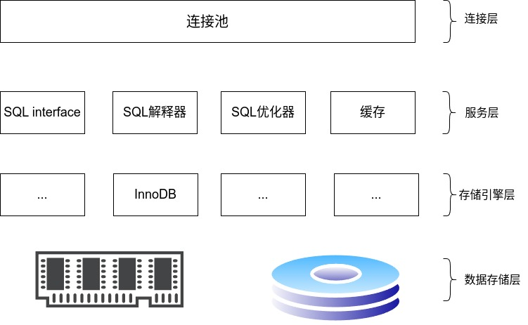
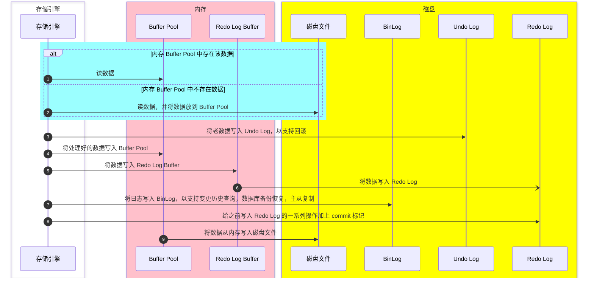

# mysql

## mysql 系统架构

## InnoDB

InnoDB 支持行锁，事务，外键

### InnoDB 写入原理

InnoDB 一切的逻辑处理和读取写入都只在内存中的数据

### 存储结构

5 类表空间：独立表空间(t.ibd)、系统表空间(ibdata1)、undo 表空间(innidb_undo.ibu)、通用表空间(diy.ibd)、临时表空间(ibtmp1)

独立表空间相较于系统表空间，独立表空间具有可压缩，可传输等优势

当执行新建表的语句后，会在 mysql 的数据区中以数据库命名的文件夹下创建一个 `表名.ibd` 文件。文件中以 **页**（大小为 16 KB） 为单位存储，
同时通过页和内存进行交互，页是 INNODB 中内存和磁盘交互的最小单位，在磁盘中的物理地址是连续的。页中包含页头、**数据行**（<= 8 KB）和页尾。

每 64 个页组成一个 **区**，通常会按照区来申请连续的磁盘空间。由 **256** 个区构成一个区组。

除此之外，还有一个用来标记区和零散页的逻辑概念 “段”，这些段分成了叶子节点段和非叶子节点段。非叶子节点段存储和管理索引数，叶子节点存储和管理实际数据。
从逻辑上讲，最终由 “叶子节点段” 和 “非叶子节点段” 构成了表空间 idb 文件。
