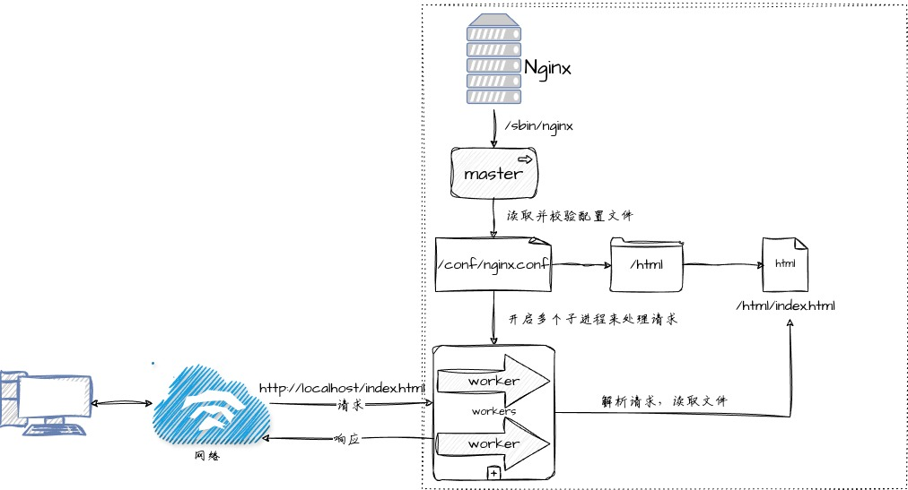

# nginx

nginx 是一个功能丰富、成熟完善的轻量级 Web 服务器，可作为 **HTTP 服务器**、**反向代理服务器**、**邮件服务器**，
支持 SSL、GZip 等多种功能，并且支持很多第三方的模块扩展。

## 代理


## 负载均衡

负载均衡(Load Balance)简单来说就是现有的请求使服务器压力太大，所以需要搭建一个服务器集群，
去分担原来一个服务器所受的压力。

### 负载均衡策略

nginx 给出三种内置的负载均衡策略：*轮询*、*加权轮询*和 *IP hash*。

1. 轮询法（默认方法）：
每个请求按时间顺序逐一分配到不同的服务器，如果服务器挂掉会自动跳过该服务器。

2. 加权轮询：
指定轮询几率，权重和访问比率成正比，当服务器的性能存在差异时，通过配置服务器的权重
可以让性能好的服务器更好发挥，有效利用资源。

3. ip hash
上面的方式存在的一个问题是在负载均衡系统中，假如用户在一台服务器具上登录了，该服务器上就存在这台服务器上了，那该用户的下一个请求过来可能会重新定位到别的服务器，
其登陆信息就丢失了。可以使用 hash 的特性、通过计算 ip 的 hash 值来定位服务器。

## 安装

[nginx 下载地址](https://nginx.org/en/download.html)

### docker 安装

```shell
# 拉取最新的镜像
docker pull nginx
# 指定版本
docker pull nginx:1.24.0
```

第一次运行镜像，用于拷贝配置文件和 html 目录到宿主机。

```shell
docker run -p 80:80 -d --name nginx nginx:latest
```

```shell
# 拷贝 Nginx 主配置文件 `/etc/nginx/nginx.conf`
docker cp nginx:/etc/nginx/nginx.conf /your_path/nginx/conf/

# 拷贝 Nginx 扩展配置 `/etc/nginx/cong.d`
docker cp nginx:/etc/nginx/conf.d /your_path/nginx/conf/

# 拷贝 Nginx html 目录 `/usr/share/nginx/html`。这是默认的文档根目录。
docker cp nginx:/usr/share/nginx/html /your_path/nginx/html

```

停止并删除容器，配置数据卷重新运行

```shell
docker stop nginx && docker rm nginx
```

```shell
创建一个 docker 的网络，方便之后与其他的容器进行通信

```shell
docker network create nginx_net
```

启动 nginx

```shell
docker run --network nginx_net \
  --name nginx \
  -d \
  -p 80:80 \
  -v /data/nginx/conf/nginx.conf:/etc/nginx/nginx.conf \
  -v /data/nginx/conf/conf.d:/etc/nginx/conf.d \
  -v /data/nginx/html:/usr/share/nginx/html \
nginx:latest
```

## 基本流程

nginx 是基于多进程工作的，主进程(master)负责读取和教研配置文件，以及开启多个子进程来处理实际的响应请求，子进程(worker)负责具体的请求处理。



可以使用 `docker top nginx` 来查看容器内所有关于 nginx 的进程。

## 配置

### 配置结构


### 最小配置

```shell

user  nginx;
worker_processes  auto;
# debug info notice warn error crit
error_log  /var/log/nginx/error.log notice;
pid        /var/run/nginx.pid;


events {
    # 事件驱动模块

    # 使用epoll来高效通信，默认是开启的
    use epoll;
    # 指的是1个worker同时可以处理多少个连接
    worker_connections  1024;
}


http {
    # 返回的数据类型
    include       /etc/nginx/mime.types;
    # 如果不在 mime.types 中，要么在 mime.types 中配置，要么按 default_type 返回
    default_type  application/octet-stream;

    log_format  main  '$remote_addr - $remote_user [$time_local] "$request" '
                      '$status $body_bytes_sent "$http_referer" '
                      '"$http_user_agent" "$http_x_forwarded_for"';

    access_log  /var/log/nginx/access.log  main;

    # 使用 linux 的 sendfile(socket, file, len) 来进行高效的网络传输，底层是零拷贝
    sendfile        on;
    
    # 当打开 tcp_nopush ，数据量达到一定量时进行批量传输
    tcp_nopush      on;

    # 长连接时间
    keepalive_timeout  65;

    # 打开 gzip 压缩来提高传输效率，但是需要消耗服务器 cpu 来进行压缩
    gzip             on;

  # 虚拟主机 vhost
  server {
    listen  80;
    server_name localhost; # 域名、主机名

    # 相对目录
    localhost / {
      root html;
      index index.html index.htm;
    }
  }


    include /etc/nginx/conf.d/*.conf;
}
```

## 虚拟主机与域名解析

虚拟主机指的是多个域名，或同一个域名的不同端口（域名+端口要有唯一性）同时映射到同一个 IP 地址上。

### 域名解析

这里的域名解析主管是指本地的`hosts`文件， windows 系统中在 `C:\windows\system32\drivers\etc\hosts`
linux 系统在 '/etc/hosts'

```shell
ip在前 域名在后
192.168.21.100 new001
```

## server_name 匹配规则

server_name 按完整匹配、通配符匹配、后通配符、正则匹配，如果都不匹配，则找到 listen 中配置 default 的

### 完整匹配

```shell
# 一个server_name后面可以配置多个主机域名
server_name domain.com source.com;
```

### 通配符匹配

```shell
# 使用通配符，所有以 domain.com 结尾的都能匹配到
server_name *.domain.com;
```

### 通配符结束匹配

```shell
# 以 domain 开始的都能匹配到
server_name domain.*;
```

### 正则匹配

```shell
server_name ~^[0-9]+\.domain\.com$;
```

## 反向代理

```shell
server {
  listen 80;
  server_name localhost;
  location / {
    proxy_pass http://www.baidu.com;

    # 一旦配置了proxy_pass就不会再去找 root 目录的静态文件了
  }
}
```

## 负载均衡配置

```shell
upstream loadbanance {
  server 192.168.31.100:80;
  server 192.168.31.101:80;
}

server {
  listen 80;
  server_name localhost;
  location / {
    proxy_pass http://loadbanance;
  }
}
```

### 权重

```shell

upstream loadbanance {
  # 配置权重
  server 192.168.31.100:80 weight=8;
  server 192.168.31.101:80 weight=2;
  # 不参与负载均衡  
  server 192.168.31.102:80 weight=1 down;
  # 当前面的机子都不能用的时候，使用 backup 服务器
  server 192.168.31.103:80 weight=2 backup; 
}

server {
  listen 80;
  server_name localhost;
  location / {
    proxy_pass http://loadbanance;
  }
}
```

## 动静分离

通过在location中使用 proxy_pass 来实现动态请求，在另一个location中配置root来实现静态资源的请求。

## urlrewrite

url rewrite 就是把请求重定向到其他 URL 的过程。
rewrite 指令最后跟一个 flag 标记。

| flag   | 解释    |
|--------------- | --------------- |
| last   | 表示完成 rewrite   |
| break   | 本条规则匹配完成后，终止匹配，不再匹配后面的规则    |
| redirect   | 返回 302 临时重定向，浏览器地址会显示跳转后的URL地址   |
| permanent  | 返回 301 永久重定向，浏览器地址会显示跳转后的URL地址   |

### rewrite 相关指令

```shell
if (condition) { ... }

if 支持如下条件判断匹配符号
~         正则匹配，区分大小写
~*        正则匹配，不区分大小写
!~        正则不匹配，区分大小写
!~*       正则不匹配，不区分大小写
-f & ! -f 用来判断是否存在文件
-d & ! -d 用来判断是否存在目录
-e & ! -e 用来判断是否存在目录或文件
-x & ! -x 用来判断文件是否可以执行

# 在匹配过程中可以使用一些 nginx 的全局变量
$args               请求的参数
$query_string       与 $args 相同
$document_root      针对当前请求的根路径设置值
$host               请求信息中的 host，如果请求中没有 host 行，则等于设置的服务器名
$limit_rate         对连接速率的限制
$request_method     请求的方法，如 GET 、 POST
$remote_addr        客户端地址
$http_x_forwarded_for 客户端地址
$remote_port        客户端端口
$remote_user        客户端用户名，认证用
$request_filename   当前请求的文件路径名
$request_uri        表示客户端请求的完整 URI
$document_uri       和 $request_uri一样
$scheme             表示当前请求用的协议，http or https
$server_protocol    请求的协议版本 "HTTP/1.0" 或 "HTTP/1.1"
$server_addr        服务器地址，如果没有使用 listen 指明服务器地址，使用这个变量将发起一次系统调用以取得地址
$server_name        请求到达的服务器名
$server_port        请求到达的服务器端口号

```

## 防盗链

valid_refer：nginx 会匹配 referer 和 valid_refer 后面的内容，匹配成功就将变量 $invalid_referer 置为0，否则置为1,匹配过程中不区分大小写。

`valid_refer none|blocked|server_names|string...`

none: 如果 header 中的 referer 为空，允许访问
blocked: 如果 header 中的 referer 不为空，但是被防火墙或代理服务器伪装过，这种情况该头域的值不以 "http" or "https" 开头。

```shell
localhost ～*(js|css|img) {
  valid_refer.ers 192.168.31.100;
  if($invalid_referer) {
    return 403;
  }
}
```
