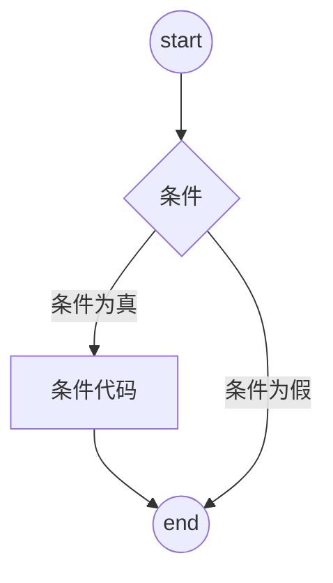

# Python 基础

<!--toc:start-->

- [Python 基础](#python-基础)
  - [基础语法](#基础语法)
    - [编码](#编码)
    - [标识符](#标识符)
    - [保留字](#保留字)
    - [注释](#注释)
    - [行与缩进](#行与缩进)
    - [多行语句](#多行语句)
    - [数字(Number)类型](#数字number类型)
    - [字符串](#字符串)
    - [空行](#空行)
    - [同一行显示多条语句](#同一行显示多条语句)
    - [import 和 from ... import](#import-和-from--import)
  - [基本数据类型](#基本数据类型)
    - [Number](#number)
    - [String](#string)
    - [bool](#bool)
    - [List](#list)
    - [Tuple](#tuple)
    - [Set](#set)
    - [Dictionary](#dictionary)
    - [bytes](#bytes)
  - [数据类型转换](#数据类型转换)
    - [隐式类型转换](#隐式类型转换)
    - [显式类型转换](#显式类型转换)
  - [运算符](#运算符)
    - [算数运算符](#算数运算符)
    - [比较运算符](#比较运算符)
    - [赋值运算符](#赋值运算符)
    - [位运算符](#位运算符)
    - [逻辑运算符](#逻辑运算符)
    - [成员运算符](#成员运算符)
    - [身份运算符](#身份运算符)
  - [Python3 数字](#python3-数字)
    - [数学函数](#数学函数)
    - [随机数函数](#随机数函数)
    - [三角函数](#三角函数)
    - [数学常量](#数学常量)
  - [Python3 字符串](#python3-字符串)
    - [Python 字符串运算符](#python-字符串运算符)
    - [f-string](#f-string)
    - [Python 的字符串内建函数](#python-的字符串内建函数)
  - [Python3 列表](#python3-列表)
    - [列表函数](#列表函数)
  - [Python3 元组](#python3-元组)
  - [Python3 字典](#python3-字典)
    - [字典函数](#字典函数)
  - [Python3 集合](#python3-集合)
    - [集合函数](#集合函数)
  - [Python3 条件控制](#python3-条件控制)
    - [if-elif-else](#if-elif-else)
    - [match...case](#matchcase)
  - [Python3 循环语句](#python3-循环语句)
    - [while](#while)
    - [简单语句组](#简单语句组)
    - [for语句](#for语句)
    - [range() 函数](#range-函数)
    - [break和continue语句](#break和continue语句)
    - [pass 语句](#pass-语句)
    - [end关键字](#end关键字)
  - [Python3 推导式](#python3-推导式)
    - [列表推导式](#列表推导式)
    - [字典推导式](#字典推导式)
    - [集合推导式](#集合推导式)
  - [Python3 迭代器与生成器](#python3-迭代器与生成器)
    - [迭代器](#迭代器)
    - [创建一个迭代器](#创建一个迭代器)
    - [StopIteration](#stopiteration)
    - [生成器](#生成器)
  - [Python3 函数](#python3-函数)
    - [参数](#参数)
    - [匿名函数](#匿名函数)
    - [强制位置参数](#强制位置参数)
  - [Python3 装饰器](#python3-装饰器)
    - [装饰器的应用场景](#装饰器的应用场景)
      - [基本语法](#基本语法)
      - [带参数的装饰器](#带参数的装饰器)
      - [类装饰器](#类装饰器)
  - [Python3 模块](#python3-模块)
    - [`__name__` 属性](#__name__-属性)
  - [Python3 输入和输出](#python3-输入和输出)
    - [读取键盘输入](#读取键盘输入)
    - [读写文件](#读写文件)
    - [pickle 模块](#pickle-模块)
  - [Python3 file](#python3-file)
    - [file对象](#file对象)
  - [Python3 OS 文件/目录](#python3-os-文件目录)
  - [Python3 错误和异常](#python3-错误和异常)
    - [try-finally](#try-finally)
    - [抛出异常](#抛出异常)
    - [用户自定义异常](#用户自定义异常)
    - [with 关键字](#with-关键字)
  - [Python3 面向对象](#python3-面向对象)
    - [类属性与方法](#类属性与方法)
    - [类的专有方法](#类的专有方法)
    - [global 和 nonlocal关键字](#global-和-nonlocal关键字)
  - [Python3 标准库概览](#python3-标准库概览)
  - [Python3 正则表达式](#python3-正则表达式)
    - [re.match函数](#rematch函数)
    - [flags](#flags)
    - [正则表达式模式](#正则表达式模式)
    - [re.search 方法](#research-方法)
    - [re.match 与 re.search 的区别](#rematch-与-research-的区别)
    - [检索和替换](#检索和替换)
    - [compile 函数](#compile-函数)
    - [findall](#findall)
    - [re.split](#resplit)
  - [Python3 SMTP 发送邮件](#python3-smtp-发送邮件)
  - [Python3 多线程](#python3-多线程)
    - [线程模块](#线程模块)
  - [pip](#pip)
  - [Python 并发编程](#python-并发编程)
  - [枚举(enum)](#枚举enum)
  - [字符串格式化](#字符串格式化)
    - [%操作符](#操作符)
    - [format()方法](#format方法)
    - [f-string用法](#f-string用法)
    - [类型标注](#类型标注)

[toc]

## 基础语法

### 编码

默认情况下，Python3的默认编码是UTF-8。一般来说默认即可。当然你也可以给你的文件指定不同的编码。

```python
# -*- coding: cp-1252 -*-
```

### 标识符

- 第一个字符必须是字母或下划线。
- 标识符的其他部分由字母、数字和下划线组成。
- 标识符大小写敏感。

### 保留字

保留字即关键字，不能作为标识符名称。可以使用 keyword 模块去查看当前版本所有的关键字。

```python
import keyword
keyword.kwlist
```

### 注释

Python 中单行注释使用 `#` 开头。多行注释可以使用 `'''` 和 `"""`。

### 行与缩进

python使用缩进来表示代码块，不需要使用大括号。缩进的空格数可变，但是同一个代码块的语句必须具有相同的缩进空格数。

### 多行语句

Python 通常是一行写完一条语句，但是如果语句很长，可以使用反斜杠 `\` 来实现多行语句，例如：

```python
total = item_one + \
        item_two + \
        item_three
```

在 [],{},() 中的多行语句不需要使用反斜杠。

### 数字(Number)类型

Python中有四种数字类型：整数、布尔值、单精度（浮点数）和双精度（复数）。

### 字符串

- Python 中单引号 `'` 和双引号 '"' 使用完全相同。
- 使用三引号 `'''` 或 `"""` 可以指定一个多行的字符串。
- 转义符 `\`.。
- 使用转义符可以用来转义，使用 `r` 可以让反斜杠不发生转义。
- 字符串可以使用运算符 `+` 连在一起，使用 `*` 重复字符串。
- Python 中有两种索引方式，从左往右以 `0` 开始，从右往左以 `-1` 开始。
- Python 中的字符串不能改变。
- Python 中没有单独的字符类型，一个字符就是长度为1的字符串。
- 字符串切片 `str[start:end:step]`，其中 start 是包含切片的开始索引，end 是不包含结束的切片结束索引，setp是步长。

### 空行

函数之间或类之间使用空行分隔，表示一段新的代码的开始。类和函数入口也用一行空行分隔，以突出函数入口的开始。
空行与代码缩进不同，空行并不是 Python 语法的一部分。书写时不插入空行，Python 解释运行也不会出错。但是空行的作用在于分隔两端不同功能或含义的代码，便于日后代码的维护或重构。

### 同一行显示多条语句

Python 可以在同一行中使用多条语句，语句之间使用分号 `;` 分隔。

### import 和 from ... import

在 Python 使用 `import` 或 `from ... import` 来导入相应的模块。
将整个模块导入，使用 `import somemodule`
从某个模块中导入某个函数，格式为：`from somemodule import somefunction`
从某个模块中导入多个函数，格式为：`from somemodule import firstfunc, secondfunc`
将某个模块中的全部函数导入，格式为: `form somemodule import *`

## 基本数据类型

Python 中的变量不需要声明。每个变量在使用前都必须赋值，变量赋值以后该变量才会被创建。使用 `=` 来给变量赋值。
Python 允许同时给多个变量赋值。例如：

```python
a = b = c = 1
a, b, c = 1, 2, "hello"
```

- **不可变数据(3个)** : Number、String、Tuple;
- **可变数据 (3 个)** : List、Dictionary、Set。
  此外还有一些高级的数据类型，如字节数组类型(bytes)。

### Number

Python3 支持 int、float、bool、complex。
在 Python3 中，只有一种整数类型 int，表示长整形，没有 Python2 中的 Long。
可以使用内置的函数 `type()` 来查询变量所指的对象类型。
也可以使用 isinstance 来判断，此二者的区别是：`type()`不会认为子类是一种父类类型而 `isinstance()`会认为子类是一种父类类型。

```python
a,b = 1, "hello"

type(a)
isinstance(b, String)
```

可以使用 `del` 来删除对象的引用，可以删除单个或多个对象。

### String

Python 中的字符串不能被改变。向一个索引位置赋值，比如 `word[0] = 'm'` 会导致错误。

1. 反斜杠可以用来转义，使用r可以让反斜杠不发生转义。
2. 字符串可以使用+运算符连接在一起，用*运算符重复，比如 `print(str * 2)` 就可以打印两次。
3. Python 中的字符串有两种索引方式，从左往右以0开始，从右往左以-1开始。
4. Python 中的字符串不能改变。

### bool

- 布尔只有两个值：True 和 False。
- 布尔类型可以和其他数据类型进行比较，比如数字、字符串等。在比较时，Python 会将 True 视为1、False 视为0。
- 布尔类型可以和逻辑运算符一起使用，包括 and、or 和 not。这些运算符可以用来组合多个布尔表达式，生成一个新的布尔值。
- 布尔类型也可以转换成其他的数据类型，必须整形、浮点数和字符串。转换时 True 会被转换为1， False会被转换为 0。
- 在 Python 中，所有非零的数字和非空的字符串、列表、元组等数据类型都被视为 True，只有0、空字符串、空列表、空元组等被视为False。因此，在进行布尔类型的转换时，需要注意数据类型的真假性。

### List

列表是写在 `[]` 之间的，使用逗号分隔开的元素列表。
列表可以被索引和截取，列表被截取后返回一个包含所需元素的新列表。
列表截取的语法：

```python
变量[头下标:尾下标:步长]
# 索引从0开始，-1为从末尾的开始位置。
```

### Tuple

元组与列表类似，不同的在于元组的元素不能修改。元组写在`()`内，元素之间用逗号隔开。

### Set

Python 中的集合是一种无序、可变的数据类型，用于存储唯一的元素。
集合使用`{}`表示，元素之间用`,`分隔。也可以使用`set()`函数创建。

> [!IMPORTANT]
> 创建一个空集合必须用`set()`而不是`{}`，因为`{}`是用来创建一个空字典。

### Dictionary

字典是一种映射类型，字典用`{}`标识，它是一个无序的**键(key):值(value)**的集合。
key必须使用不可变类型，同一个字典中，key必须是唯一的。
构造函数`dict()`可以直接从键值对序列中构建字典：

```python
dict([('runood', 1), ('google', 2), ('test', 3)])

```

### bytes

Python3中，bytes类型表示的是不可变的二进制序列。bytes类型中的元素是整数值（0~255），通常处理二级制数据，比如图像文件、音频文件等等。在网络编程中，也经常使用bytes类型来传输二进制数据。

创建bytes对象的方式由很多，最常见的方式是使用b前缀；

此外，也可以使用`bytes()`函数将其他类型对象转为bytes类型。第一个参数是要转换的对象，第二个是编码方式，如果省略第二个参数，则默认使用UTF-8编码。

```python
x = bytes("hello", encoding="utf-8")
x = b"hello"
y = x[1:3]
z = x + b"world"
```

## 数据类型转换

| 函数                   | 描述                                               |
| ---------------------- | -------------------------------------------------- |
| int(x\[,base\])        | x：字符串或数字，base：进制                        |
| float(x)               | 将x转为一个浮点数                                  |
| complex(real\[,imag\]) | 创建一个复数                                       |
| str(x)                 | 将x转为字符串                                      |
| repr(x)                | 将x转为表达式字符串                                |
| eval(x)                | 用来计算在字符串中有效Python表达式，并返回一个对象 |
| tuple(s)               | 将序列s转为一个元组                                |
| list(s)                | 将序列s转为一个列表                                |
| dict(d)                | 创建一个字典。d必须是一个key，value元组序列        |
| frozenset(s)           | 转换为不可变集合                                   |
| chr(x)                 | 将一个整数转换为一个字符                           |
| ord(x)                 | 将一个字符转为它的整数值                           |
| hex(x)                 | 将一个整数转为一个十六进制字符串                   |
| oct(x)                 | 将一个整数转换为一个八进制字符串                   |

### 隐式类型转换

在隐式类型转换中，Python会自动将一种数据类型转为另一种数据类型。针对不同类型的数据进行运算，较低数据类型会转为较高数据类型避免数据丢失。

```python
num_int = 123
num_flo = 1.23
# num_new的类型为float
num_new = num_int + num_flo
```

### 显式类型转换

在显式类型转换中，使用`int()`等预定义函数来执行显示类型转换。

## 运算符

### 算数运算符

| 运算符 | 描述                                 |
| :----: | ------------------------------------ |
|   +    | 两个对象相加                         |
|   -    | 两个对象相减                         |
|   \*   | 两数相乘或返回一个重复若干次的字符串 |
|   /    | 两数相除                             |
|   %    | 取模                                 |
|  \*\*  | 幂乘                                 |
|   //   | 取整除，向下缩进                     |

### 比较运算符

| 运算符 | 描述                   |
| :----: | ---------------------- |
|   ==   | 比较对象是否相等       |
|   !=   | 比较两个对象是否不相等 |
|   >    | 大于                   |
|   <    | 小于                   |
|   >=   | 大于等于               |
|   <=   | 小于等于               |

### 赋值运算符

| 运算符 | 描述                               |
| :----: | ---------------------------------- |
|   =    | 简单赋值                           |
|   +=   | 加法赋值                           |
|   -=   | 减法赋值                           |
|  \*=   | 乘法赋值                           |
|   /=   | 除法赋值                           |
|   %=   | 取模赋值                           |
| \*\*=  | 幂赋值                             |
|  //=   | 整除赋值                           |
|   :=   | 海象运算符，同时赋值和返回赋值的值 |

在Python 3.8 + 及更高版本中，引入了`:=`（海象运算符），可以同时进行赋值和返回赋值的值。

```python
# 传统写法
n = 10
if n > 5:
  print(n)

# 使用海象运算符
if (n := 10) > 5:
  print(n)
```

### 位运算符

| 运算符 | 描述         |
| :----: | ------------ |
|   &    | 按位与       |
|   \|   | 按位或       |
|   ^    | 按位异或     |
|   ~    | 按位取反     |
|   <<   | (有符号)左移 |
|   >>   | 右移         |

### 逻辑运算符

| 运算符 | 描述   |
| ------ | ------ |
| and    | 逻辑与 |
| or     | 逻辑或 |
| not    | 逻辑非 |

### 成员运算符

| 运算符 | 描述                             |
| ------ | -------------------------------- |
| in     | 在指定的序列中找到则返回True     |
| not in | 在指定序列中找不到该值则返回True |

### 身份运算符

身份运算符用于比较两个对象的存储单元

| 运算符 | 描述                                    |
| ------ | --------------------------------------- |
| is     | is判断两个标识符是否引用自同一个对象    |
| is not | is not 判断两个标识符是否引用不同的对象 |

> [!TIP]
> is 和 == 的区别是：is比较地址值、==比较对应的值是否相等

## Python3 数字

Python中的数字变量在赋值的时候创建对象。

可以使用`del`语句删除一些数字对象的引用。

```python
del var1\[,var2\[,var3]]
```

Python支持三种不同的数值类型：

- **整形(int)** ：Python3整形是没有大小限制的，可以当作Long类型使用。布尔是整形的子类型。
- **浮点型(float)** ：浮点型有整数部分和小数部分组成，浮点型也可以使用科学计数法表示。
- **复数(complex)** ：复数由实数部分和虚数部分构成，可以使用a+bj，或者complex(a,b)表示，复数的实部a和虚部b都是浮点型。

### 数学函数

| 函数           | 描述                                                   |
| -------------- | ------------------------------------------------------ |
| abs(x)         | 返回数字的绝对值                                       |
| ceil(x)        | 返回数字的向上取整                                     |
| exp(x)         | 返回e的x次幂(e^x^)                                     |
| fabs(x)        | 返回浮点型是的绝对值                                   |
| floor(x)       | 返回数字的向下取整                                     |
| log(x)         | 返回以e为底，x的对数                                   |
| max(x1,x2,...) | 返回给定参数的最大值                                   |
| min(x1,x2,...) | 返回给定参数的最小值                                   |
| modf(x)        | 返回x的整数部分与小数部分，符号与x相同，都以浮点数表示 |
| pow(x,y)       | x^y^运算的值                                           |
| round(x\[,n])  | 返回浮点数x的自舍五入值，n为保留的位数                 |
| sqrt(x)        | 返回数字x的平方根                                      |

### 随机数函数

| 函数                            | 描述                                                                |
| ------------------------------- | ------------------------------------------------------------------- |
| choice(seq)                     | 从序列的元素中随机挑选一个元素                                      |
| randrange(\[start]stop\[,step]) | 从指定范围内，按指定的基数递增的集合中获取一个随机数，基数默认值为1 |
| random()                        | 随机生成一个实数，在\[1,0)范围内                                    |
| seed([x])                       | 改变随机数生成器的种子                                              |
| shuffle(lst)                    | 将序列的所有元素随机排列                                            |
| uniform(x,y)                    | 随机生成下一个实数，范围在\[x,y]内                                  |

### 三角函数

| 函数       | 描述                                             |
| ---------- | ------------------------------------------------ |
| acos(x)    | 返回x的反余弦弧度值                              |
| asin(x)    | 返回x的反正弦弧度值                              |
| atan(x)    | 返回x的反正切弧度值                              |
| atan2(x,y) | 返回给定的x及y坐标值的反正切值                   |
| cos(x)     | 返回x的弧度的余弦值                              |
| hypot(x,y) | 返回欧几里得范数 sqrt(x\*x + y\*y)               |
| sin(x)     | 返回x弧度的正弦值                                |
| tan(x)     | 返回x弧度的正切值                                |
| degrees(x) | 将弧度转换为角度，如degrees(math.pi/2), 返回90.0 |
| radian(x)  | 将角度转为弧度                                   |

### 数学常量

| 常量 | 描述            |
| ---- | --------------- |
| pi   | 数学常量pi（Π） |
| e    | 自然常数        |

## Python3 字符串

Python 不支持单字符类型，单字符在Python中也是作为一个字符串使用。
Python 访问子字符串，可以使用方括号`[]`来截取子字符串。

Python字符串一行写不完时，使用`\`进行续行。 使用`\r`后面的内容移到字符串开头，并逐一替换开头部分的字符，直至将`\r`后面的内容完全替换完成。

使用`\r`实现百分比进度：

```python
import time

for i in range(101):
  print("\r{:3}%".format(i), end = ' ')
  time.sleep(0.05)
```

### Python 字符串运算符

| 操作符 | 描述                           |
| ------ | ------------------------------ |
| +      | 字符串连接                     |
| \*     | 重复输出字符串                 |
| \[]    | 通过索引获取字符串中的字符     |
| \[:]   | 左闭右开，截取字符串中的一部分 |
| in     | 字符串中包含特定字符返回True   |
| not in | 字符串中不包含给定字符返回True |
| r/R    | 可以避免字符串转义             |
| %      | 格式化字符串                   |

### f-string

f-string 是3.6之后的版本添加的，称之为字面量格式化字符串。

**f-string** 格式化字符串以`f`开头，后面跟着字符串，字符串中表达式用大括号{}包起来，会将变量或表达式计算后的值替换进去。

### Python 的字符串内建函数

| 函数                               | 描述                                     |
| ---------------------------------- | ---------------------------------------- |
| capitalize()                       | 将字符串的第一个字符转为大写             |
| center(width,fillchar)             | 指定宽度居中字符串，fillchar（默认空格） |
| count(str,beg=0,end=len(string))   | str在string中出现的次数                  |
| bytes.decode(encoding="utf-8")     | 返回给定的编码的bytes对象                |
| encode(encoding="utf-8")           | 解码                                     |
| endswith(suffix)                   | 是否以suffix结尾                         |
| expandtabs(tabsize=8)              | 将字符串中的tab转为空格                  |
| find(str,beg=0,end=len(string))    | str是否在字符串中，有返回索引，没有-1    |
| index(str,beg=0,end=len(string))   | 和find一样，只不过不在时返回异常         |
| isalumn()                          | 所有的字符都是字母或数字返回True         |
| isalpha()                          | 所有字符都是字母或中文                   |
| isdigit()                          | 都是数字返回True                         |
| islower()                          | 所有的都是小写                           |
| isnumeric()                        | 只包含数字字符                           |
| isspace()                          | 只包含空白，则返回True                   |
| istitle()                          | 字符串时标题化的                         |
| isupper()                          | 所有都是大写                             |
| join()                             | 以指定字符串作为分隔符                   |
| len(string)                        | 返回字符串长度                           |
| ljust(width\[,fillchar])           | 返回一个源字符串的左对齐                 |
| lower()                            | 转换大写为小写                           |
| lstrip()                           | 截掉左边的空格或指定字符                 |
| maketrans()                        | 转换字符映射                             |
| max(str)                           | 返回字符串中最大的字母                   |
| min(str)                           | 返回字符串中最小的字母                   |
| replace(old,new\[,max])            | old -> new                               |
| rfind(str,beg=0,end=len(string))   | 类似find，不过从右边开始                 |
| rindex(str,beg=0,end=len(string))  | 类似index，从右边开始                    |
| rjust(width\[,fillchar])           | 返回元字符串的右对齐                     |
| rstrip()                           | 删除字符串末尾的空格或指定字符           |
| split(str="",n=string.count(str))  | 以str分隔截取字符串                      |
| splitlines(\[keepends])            | 按行分隔，keepends为True保留换行符       |
| startwith(s,beg=0,end=len(string)) | 是否以s开头                              |
| strip(\[chars])                    | 删除两边空格                             |
| swapcase()                         | 大小写互相转化                           |
| title()                            | 标题化字符串                             |
| translate(table,delete="")         | 字符转换                                 |
| upper()                            | 小写转大写                               |
| zfill(width)                       | 返回长度为width的字符串                  |
| isdecimal()                        | 检测是否只包含十进制字符                 |

## Python3 列表

### 列表函数

| 函数                   | 描述                                 |
| ---------------------- | ------------------------------------ |
| len(list)              | 列表元素个数                         |
| max(list)              | 返回列表最大值                       |
| min(list)              | 返回列表最小值                       |
| list(seq)              | 将元组转为列表                       |
| list.append(obj)       | 在列表末尾添加新的对象               |
| list.count(obj)        | 统计某个元素在列表中出现的次数       |
| list.extend(seq)       | 在列表末尾一次性追加另一个序列中的值 |
| list.index(obj)        | 从列表中找出第一个匹配项的索引       |
| list.insert(index,obj) | 将对象插入列表                       |
| list.pop(\[index=-1])  | 移除列表中的元素，并返回该元素的值   |
| list.remove(obj)       | 移除列表中某个值的第一个匹配项       |
| list.reverse()         | 反向列表中的元素                     |
| list.sort()            | 列表排序                             |
| list.clear()           | 清空列表                             |
| list.copy()            | 复制列表                             |

## Python3 元组

Python 的元组与列表类似，不同之处在于元组的元素不能修改。
元组使用小括号`()`，列表使用方括号`[]`。

元组中只包含一个元素时，需要在元素后面添加逗号`,`，否则括号会被当作运算符使用。

## Python3 字典

字典的键必须是唯一的，但值不必。

使用`{}`或内置函数`dict()`创建字典。

使用`del`可以删除单一元素也能清空字典。

```python
# 删除单一元素
del tinydict['key']

# 清空字典
tinydict.clear()

# 删除字典
del tinydict
```

### 字典函数

| 函数                              | 描述                                      |
| --------------------------------- | ----------------------------------------- |
| len(dict)                         | 字典元素的个数                            |
| str(dict)                         | 输出字典的字符串表示                      |
| type(dict)                        | 返回类型                                  |
| dict.clear()                      | 清空字典                                  |
| dict.copy()                       | 返回一个字典的潜复制                      |
| dict.fromkeys()                   | 创建一个字典，val为字典所有键对应的初始值 |
| dict.get(key, default=None)       | 返回指定键的值                            |
| key in dict                       | 键在字典中返回True                        |
| dict.items()                      | 以列表返回一个视图对象                    |
| dict.keys()                       | 返回一个key视图对象                       |
| dict.setdefault(key,default=None) | 和get类似，键不存则添加                   |
| dict.update(dict2)                | 把字典dict2的键值对更新到dict里           |
| dict.values()                     | 返回一个视图对象                          |
| pop(key\[,default])               | 删除字典key对应的值，返回被删除的值       |
| popitem()                         | 返回并删除字典中的最后一对键和值          |

## Python3 集合

集合可以使用`{}`或`set()`创建集合，创建一个空集合必须使用`set()`而不是`{}`，因为`{}`是用来创建一个空字典。

### 集合函数

| 方法                          | 描述                                         |
| ----------------------------- | -------------------------------------------- |
| add()                         | 添加元素                                     |
| clear()                       | 清空集合                                     |
| copy()                        | 拷贝集合                                     |
| difference()                  | 返回多个集合的差集                           |
| difference_update()           | 移除集合的元素                               |
| discard()                     | 删除集合中指定的元素                         |
| intersection()                | 返回集合的交集                               |
| intersection_update()         | 返回集合的交集                               |
| isdisjoint()                  | 判断两个集合是否包含相同的元素               |
| issubset()                    | 判断指定集合是否为该方法参数集合的子集       |
| issuperset()                  | 判断该方法的参数集合是否为指定集合的子集     |
| pop()                         | 随机移除元素                                 |
| remove()                      | 移除指定元素                                 |
| symmetric_difference()        | 返回两个集合中不重复的元素集合               |
| symmetric_difference_update() | 移除集合中另一个集合相同元素，不同的元素插入 |
| union()                       | 返回两个集合的并集                           |
| update()                      | 给集合添加元素                               |
| len()                         | 计算集合元素的个数                           |

## Python3 条件控制



### if-elif-else

```python
if condition1:
 # sth
elif condition2:
 # sth
else:
 # sth
```

### match...case

Python3.10 增加了`match...case`的条件判断，不需要使用一连串的`if-else`来判断了。
match 后的对象会依次与 case 后的内容进行匹配，如果匹配成功，则执行匹配到的表达式，否则直接跳过，`_`可以匹配一切。

```python
match subject:
  case <pattern_1>:
    <action_1>
  case <pattern_2>:
    <action_2>
  case <pattern_3>|<pattern_4>|<pattern_5>:
    <action_3>
  case _:
    <action_default>
```

## Python3 循环语句

Python 中的循环语句有 for 和 while。

### while

```python
while condition:
  action
else:
 # 如果while后面的条件为False时，则执行else的语句块
```

### 简单语句组

类似if语句的语法，如果while循环体中只有一条语句，你可以将该语句与while写在同一行中。

```python
flag = 1
while(flag): print("hello world")
```

### for语句

Python for 循环可以遍历任何可迭代对象，如一个列表或者一个字符串。

```python
for val in seq:
 <statements>
else:
  # 循环执行完毕会执行else的语句，如果在循环过程中遇到了break语句，则会中断循环，也不会执行else子句。
 <statements>
```

### range() 函数

如果想遍历数字序列，可以使用内置的range()函数，它可以生成序列。

```python
for i in range(5):
  print(i)
...
0
1
2
3
4
```

也可以使用range()指定区间和增量。

```python
for i in range(1, 10, 2):
  print(i)
...
1
3
5
7
9
```

### break和continue语句

break跳出循环，continue跳过本次循环。

### pass 语句

Python pass 是空语句，是为了保持程序结构的完整性。
pass不做任何的事情，一般用作占位语句。

### end关键字

end可以用于将结果输出到同一行，或者在输出结果的末尾添加不同的字符。

```python
print(b, end = ',')
```

## Python3 推导式

Python 推导式是一种独特的数据处理方式，可以从一个数据序列构建另一个新的数据序列的结构体。功能很像Java的Stream操作。

Python 支持的各种数据结果的推导式：

- 列表(list)推导式
- 字典(dict)推导式
- 集合(set)推导式
- 元组(tuple)推导式

### 列表推导式

```python
[表达式 for 变量 列表]
[out_exp_res for out_exp in input_list]

或者

[表达式 for 变量 in 列表 if 条件]
[out_exp_res for out_exp in input_list if condition]
```

- out_exp_res：列表生成元素表达式，可以是有返回值的函数。
- for out_exp in input_list：迭代input_list将out_exp传入out_exp_res表达式中。
- if condition：条件语句，可以过滤列表中不符合条件的值。

### 字典推导式

```python
{key:value for value in in collection if condition}
```

### 集合推导式

```python
{expression for item in Sequence if conditional}

### 元组推导式（生成器表达式）

元组推导式可以使用range区间、元组、列表、字典和集合等数据类型，快速生成一个满足指定需求的元组。
```

```python
(expression for item in Sequence if conditional)
```

```python
a = (x for x in range(1,10)) # 返回一个生成器对象

tuple(a) # 直接将生成器对象转换成元组
```

## Python3 迭代器与生成器

### 迭代器

迭代器是一个可以记住遍历位置的对象。迭代器对象从集合的第一个元素开始，直到所有的元素被访问完结束，迭代器只能往前不会后退。

迭代器有两个基本的方法：`iter()` 和 `next()`。字符串、列表或元组都可以创建迭代器。

```python
l = [1,2,3,4]
it = iter(l)
for x in it:
  print(x)

while True:
  try:
    print(next(it))
  except StopIteration:
    break
```

### 创建一个迭代器

把一个类作为一个迭代器使用需要在类中实现两个方法：`__iter__()`与`__next__()`。

### StopIteration

StopIteration 异常用于标识迭代的完成，防止出现无限的情况。

### 生成器

在Python中，使用`yield`的函数被成为生成器(generator)

`yield` 是一个关键字，用于定义生成器函数，生成器函数是一种特殊的函数，可以在迭代过程中逐步产生值，而不是一次性返回所有结果。

简单理解生成器就是一个迭代器，当在生成器中使用`yield`语句时，函数的执行将会暂停，并将`yield`后面的表达式作为当前迭代的值返回。

然后，每次调用生成器的`next()` 方法或使用`for` 循环进行迭代时，函数会从上次暂停的地方继续执行，直到再次遇到`yield`语句。

## Python3 函数

```python
def func_name(参数列表):
  函数体
```

### 参数

- 必须参数

  必须参数必须以正确的顺序传入函数。调用时的数量必须和声明时的一样。

```python
def add(x, y):
  return x + y

add(1, 2)
```

- 关键字参数

  关键字参数允许函数调用时参数的顺序与声明不一致，在调用时使用参数名。

```python
def add(x, y):
  return x + y

add(y = 1, x = 2)
```

- 默认参数

  函数定义时可以指定参数默认值，函数调用时如果没有传则使用默认参数。

```python
def add(x, y = 1):
  return x + y

add(x = 2)
```

- 不定长参数

加了`*`的参数会以元组(tuple)的形式导入，加了`**`的参数会以字典的形式导入。

声明函数时，参数中星号`*`可以单独出现，如果单独出现`*`，则`*`后的参数必须使用关键字导入。

### 匿名函数

Python 使用 `lambda` 来创建匿名函数。

```python
lambda [arg1 [,arg2,......argn]] : expression
```

```python
x = lambda a : a + 101

sum = lambda arg1, arg2 : arg1 + arg2
```

可以使用函数封装匿名函数，这样可以创建不同的逻辑。

### 强制位置参数

Python3.8新增了一个函数形参语法`/`, 在`/`之前的必须使用位置参数。

## Python3 装饰器

装饰器（decorators）是Python中的一种高级功能，它允许你动态地修改函数或类的行为。

装饰器是一种函数，它接受一个函数作为参数，并返回一个新的函数或修改原来的函数。

装饰器的语法使用`@decorators_name`来应用在函数或方法上。

Python还提供了一些内置的装饰器，比如`@staticmethod` 和 `@classmethod`，用来定义静态方法和类方法。

### 装饰器的应用场景

- 日志记录：装饰器可用于记录函数的调用信息，参数和返回值。
- 性能分析：可以使用装饰器来测量函数的的执行时间
- 权限控制：装饰器可用于限制对某些函数的访问权限
- 缓存：装饰器可以实现缓存函数的结果，以提高性能。

#### 基本语法

```python
def decorator_function(original_function):
  def wrapper(*args, **kwargs):
    # 调用原始函数之前增强
    before_call_code()

    result = original_function(*args, **kwargs)

    # 调用原始函数之后增强
    after_call_code()

    return result
  return wrapper

# 使用装饰器
@decorator_function
def target_function(arg1, arg2):
  pass

```

#### 带参数的装饰器

```python
def repeat(n):
  def decorator(func):
    def wrapper(*args, **kwargs):
      before_call_code()
      result = func(*args, **kwargs)
      after_call_code()
      return result
    return wrapper
  return decorator
```

#### 类装饰器

除了函数装饰器，Python还支持类装饰器，类装饰器是包含`__call__` 方法的类，它接收一个函数作为参数，并返回一个新的函数。

```python
class DecoratorClass:
  def __init__(self, func):
    self.func = func

  def __call__(self, *args, **kwargs):
    before_call_code()
    result =self.func(*args, **kwargs)
    after_call_code()
    return result
```

## Python3 模块

### `__name__` 属性

一个模块被另一个程序第一次引入时，其主程序将运行。弱国我们想在模块被引入时，模块中的某一程序块不执行，我们可以用`__name__`属性来使该程序块仅在自身运行时运行。

每个模块都有一个**name**属性，当其值是'\_\_main\_\_'时，表明该模块自身在运行，否则是被引入。

## Python3 输入和输出

- str()：函数返回一个用户易读的表达形式。
- repr()：产生一个解释器易读的表达形式。

### 读取键盘输入

`input()`

### 读写文件

`open(filename, mode)`

| 模式 | 描述                               |
| ---- | ---------------------------------- |
| r    | 只读方式，指针在文件开头。默认模式 |
| rb   | 只读，以二进制打开文件             |
| r+   | 打开文件用于读写                   |
| rb+  | 以二进制读写文件                   |
| w    | 文件不存在则创建，存在则覆盖写     |
| wb   | 二进制覆盖写                       |
| w+   | 覆盖读写                           |
| wb+  | 二进制覆盖读写                     |
| a    | 追加写                             |
| ab   | 二级制追加写                       |
| a+   | 追加读写                           |
| ab+  | 二进制追加读写                     |

`f.read([size])`

读取文件的内容，size被忽略或者为负，该文件的所有内容都将被读取并且返回。

`f.readline()`

f.readline()会从文件中读取单独的一行，如果返回一个空字符串，说明已经读取到最后一行。

`f.readlines()`

f.readlines()将返回该文件中包含的所有行。

`f.write()`

f.write(string)将string写入到文件中，然后返回写入的字符数。

`f.tell()`

f.tell()返回文件当前的指针

`f.seek()`

如果要改变文件指针当前的位置，可以使用f.seek(offset, from_what)。

- seek(x,0)：从文件首行首字符开始移动x个字符。
- seek(x,1)：表示从当前位置往后移动x个字符。
- seek(-x,2)：从文件结尾往前移动x个字符。

`f.close()`

关闭文件并释放系统的资源。

当处理一个文件对象时，使用 with 关键字是非常好的方式。在结束后会正确的关闭文件。

```python
with open('file_name', 'r') as f:
  read_data = f.read()
```

### pickle 模块

Python 的 pickle模块实现了基本数据序列和反序列化。

通过pickle的模块序列化操作，可以将程序中运行的对象信息保存到文件中，永久存储。

通过pickle模块的反序列化操作，我们能够从文件中创建上一次程序保存的对象。

```python
pickle.dump(obj,file, [,protocol])

x = pickle.load(file)
```

## Python3 file

open()方法打开一个文件，并返回一个文件对象。

```python
open(file, mode='r', buffering=-1,encoding=None,errors=None, newline=None,clossfd=True,opener=None)
```

- file：必须，文件路径
- mode：可选，文件打开模式
- buffering：设置缓冲
- encoding：一般utf8
- errors：报错级别
- newline：区分换行符
- closefd：传入的file参数类型
- opener：设置自定义开启器，开启器的返回值必须是一个打开的文件描述符。

### file对象

| 方法               | 描述                                                    |
| ------------------ | ------------------------------------------------------- |
| file.close()       | 关闭文件，释放系统资源                                  |
| file.flush()       | 强制将缓冲区内容写入文件                                |
| file.fileno()      | 返回一个整型的文件描述符，可以用在os.read方法等底层操作 |
| file.isatty()      | 如果文件连接到一个终端设备返回True                      |
| file.read(\[size]) | 从文件读取指定的字节数                                  |
| file.readline()    | 整行读取                                                |
| file.readlines()   | 读取所有行，并返回列表                                  |
| file.seek(offset)  | 移动文件读取指针到指定位置                              |
| file.tell()        | 返回文件当前位置                                        |
| file.truncate()    | 从文件的首行首字符开始截断                              |
| file.write(str)    | 将字符串写入文件，返回的是写入的字符串长度              |
| file.writelines()  | 向文件写入一个序列字符串列表，需要自己加入换行          |

## Python3 OS 文件/目录

| 方法                             | 描述                                      |
| -------------------------------- | ----------------------------------------- |
| os.access(path,mode)             | 校验权限模式                              |
| os.chdir(path)                   | 改变当前工作目录                          |
| os.chflags(path,flags)           | 设置路径的标记为数字标记                  |
| os.chmod(path,mode)              | 更改权限                                  |
| os.chown(path)                   | 更改文件的所有者                          |
| os.chroot(path)                  | 改变当前进程的根目录                      |
| os.close(fd)                     | 关闭文件描述符fd                          |
| os.closerange(fd_low, fd_high)   | 关闭low->high的描述符                     |
| os.dup(fd)                       | 复制文件描述符fd                          |
| os.dup2(fd,fd2)                  | 将一个文件描述符fd复制到另一个fd2         |
| os.fchdir(fd)                    | 通过文件描述符改变当前工作目录            |
| os.fchmod(fd, mode)              | 改变一个文件的访问权限                    |
| os.fchown(fd,uid,gid)            | 修改一个文件的所有权                      |
| os.fdatasync(fd)                 | 强制将文件写入磁盘                        |
| os,fdopen(fd\[,mode\[,bufsize]]) | 通过fd创建一个文件对象                    |
| os.fpathconf(fd,name)            | 返回一个打开的文件按系统配置信息          |
| os.fstat(fd)                     | 返回文件描述符fd的状态                    |
| os.fstatvfs(fd)                  | 返回包含fd的文件的文件系统的信息          |
| os.fsync(fd)                     | 强制将文件描述符为fd的文件写入硬盘        |
| os.ftruncate(fd,len)             | 裁剪fd对应的文件                          |
| os.getcwd()                      | 返回当前工作目录                          |
| os.getcwdb()                     | 返回一个当前工作目录的unicode对象         |
| os.isatty(fd)                    | 如果fd是打开的，同时与tty连接则返回True   |
| os.lchflags(path,flags)          | 设置路径的标记为数字标记                  |
| os.lchmod(path,mode)             | 修改连接文件权限                          |
| os.lchown(path,uid,gid)          | 更改文件所有者，类似chown，但是不追踪链接 |
| os.link(src, dst)                | 创建硬链接，dst->src                      |
| os.listdir(path)                 | 返回path指定的文件夹包含文件或文件夹列表  |
| os.lseek(fd,pos,how)             | 设置fd当前位置为pos，how方式修改          |
| os.lstat(path)                   | 像stat()，但是没有软连接                  |
| os.major(device)                 | 从原始的设备号中提取major号               |
| os.makedev(major,minor)          | 以major和minor设备号组成一个原始设备号    |
| os.makedirs(path)                | 递归文件夹创建函数                        |
| os.minor(device)                 | 从原始设备号中提取minor号                 |
| os.mkdir(path)                   | 创建文件夹                                |
| os.mkfifo(path)                  | 创建命名管道                              |
| os.mknod(filename)               | 创建一个名为filename文件系统节点          |
| os.open(file,flags\[,mode])      | 打开一个文件                              |
| os.openty()                      | 打开一个新的伪终端                        |
| os.pathconf(path,name)           | 返回相关文件的系统配置信息                |
| os.pipe()                        | 创建一个管道                              |
| os.popen(command)                | 从一个command打开一个管道                 |
| os.read(fd,n)                    | 从fd中读取最多n个字节                     |
| os.readlink(path)                | 返回软链接指向的文件                      |
| os.remove(path)                  | 删除路径为path的文件                      |
| os.removedirs(path)              | 递归删除目录                              |
| os.rename(src,dst)               | 重命名文件或目录                          |
| os.renames(old,new)              | 递归对目录进行更名                        |
| os.rmdir(path)                   | 删除一个指定的空目录                      |
| os.stat(path)                    | 获取path指定的路径的信息                  |
| os.stat_float_times()            | 决定stat_result是否以float对象显示时间戳  |
| os.statvfs(path)                 | 获取指定路径的文件系统统计信息            |
| os.symlink(src,dst)              | 创建一个软链接                            |
| os.tcgetpgrp(fd)                 | 返回与终端fd关联的进程组                  |
| os.tcsetpgrp(fd,pg)              | 设置fd关联的进程组为pg                    |
| os.ttyname(fd)                   | 返回一个字符串，表示与fd关联的终端设备    |
| os.unlink(path)                  | 删除文件路径                              |
| os.utime(path,times)             | 返回指定的path文件的访问和修改的时间      |
| os.write(fd,str)                 | 写入字符串到文件描述符fd中                |
| os.path                          | 获取文件的属性信息                        |
| os.pardir()                      | 返回当前的父目录，以字符串形式显示目录名  |
| os.replace()                     | 重命名文件或目录                          |

## Python3 错误和异常

### try-finally

```python
try:
  执行代码
except Exception as e:
  发生异常时执行的代码
else:
  没有异常时执行的代码
finally:
  无论是否异常都会执行
```

### 抛出异常

Python 使用raise语句抛出一个指定的异常。

`raise [Exception [,args[,traceback]]]`

### 用户自定义异常

可以创建一个新的异常类，异常类继承自`Exception`类，可以直接继承，或者间接继承。

```python
class ServiceException(Exception):
  def __init__(self,value):
    self.value = value

  def __str__(self):
    return repr(self.value)
```

如果一个异常在try子句里而又没有任何的except捕获，那么这个异常会在finally子句执行后被抛出。

### with 关键字

Python 中的`with`语句用于异常处理，封装了`try...except...finally`编码范式。

## Python3 面向对象

```python
class People:
  name = ''
  # 私有属性
  __price = 0

  def __init__(self,n,p):
    self.name = n
    self.__price = p

  def speak(self):
    print(self.name)

  # 单继承
  class Student(People):
    grade = ''

    def __init__(self,n,p,g):
      # 调用父类的构造函数
      People.__init__(self,n,p)
      self.grade = g

    # 覆写父类的方法
    def speak(self):
      print(self.grade)

  # 多继承
  class Teacher(People, Object):
    clazz = ''

    def __init__(self,n,p,c):
      People.__init__(self,n,p)
      Object.__init__(self,p)
      self.clazz = c
```

子类如果未重写父类的方法，调用方法时会根据父类的顺序，从左向右找对应的方法。

### 类属性与方法

类的私有属性：`__private_attrs`：两个下划线开头，声明该属性为私有。
类的私有方法：`__private_func`：两个下划线开头，声明该方法为私有。

### 类的专有方法

| 方法            | 描述                       |
| --------------- | -------------------------- |
| \_\_init\_\_    | 构造函数，在生成对象时调用 |
| \_\_del\_\_     | 析构函数，释放对象时调用   |
| \_\_repr\_\_    | 打印转换                   |
| \_\_setitem\_\_ | 按照索引进行复制           |
| \_\_getitem\_\_ | 按照索引获取值             |
| \_\_len\_\_     | 获得长度                   |
| \_\_cmp\_\_     | 比较运算                   |
| \_\_call\_\_    | 函数调用                   |
| \_\_add\_\_     | 加运算                     |
| \_\_sub\_\_     | 减运算                     |
| \_\_mul\_\_     | 乘运算                     |
| \_\_truediv\_\_ | 除运算                     |
| \_\_mod\_\_     | 求余运算                   |
| \_\_pow\_\_     | 乘方                       |

### global 和 nonlocal关键字

当内部作用域想修改外部作用域的变量时，要使用global 和 nonlocal 关键字。

```python
num = 1
def fun1():
  global num
  print(num)
  num = 123
```

想要修改嵌套作用域要使用nonlocal关键字。

```python
def outer():
  num = 10
  print(num)
  def inner():
    nonlocal num
    num = 102
    print(num)
  inner()
  print(num)
outer()
```

## Python3 标准库概览

- os模块：与操作系统交互
- sys模块：与Python解释器和系统相关的功能
- time模块：time模块提供了处理时间的函数
- datetime模块：提供了更高级的日期和时间处理函数
- random模块：生成随机数的函数
- math模块：提供了数学函数
- re模块：正则表达式处理函数
- json模块：JSON编码和解码函数
- urllib模块：提供了访问网页和处理URL的功能

## Python3 正则表达式

### re.match函数

re.match从字符串的起始位置匹配一个模式，如果不是起始位置匹配成功则返回None。

`re.match(pattern, string, flags=0)`

函数参数说明

| 参数    | 描述                                                   |
| ------- | ------------------------------------------------------ |
| pattern | 匹配的正则表达式                                       |
| string  | 要匹配的字符串                                         |
| flags   | 标志位，控制匹配方式，如：是否区分大小写，是否多行匹配 |

### flags

| 修饰符   | 描述                            |
| -------- | ------------------------------- |
| re.I     | 忽略大小写                      |
| re.M     | 多行匹配                        |
| re.S     | 使.匹配包括换行符在内的任意字符 |
| re.ASCII | 仅匹配ASCII字符                 |
| re.X     | 忽略空格和注释                  |

### 正则表达式模式

| 模式       | 描述                                                    |
| ---------- | ------------------------------------------------------- |
| ^          | 匹配字符串的开头                                        |
| $          | 匹配字符串的末尾                                        |
| .          | 匹配除了换行符的任意字符，flags为re.S时则可以匹配换行符 |
| \[...]     | 匹配任意一个字符                                        |
| \[^...]    | 匹配不在[]中的字符                                      |
| re\*       | 匹配0个或多个表达式                                     |
| re+        | 匹配1个或多个表达式                                     |
| re?        | 匹配0个或1个表达式，非贪婪匹配                          |
| re{n}      | 匹配n个表达式                                           |
| re{n,}     | 精确匹配前n个表达式                                     |
| re{n,m}    | 匹配n到m次片段，贪婪模式                                |
| a\|b       | 匹配a或b                                                |
| (re)       | 匹配括号内的表达式，也表示一个组                        |
| (?imx)     | 正则包含三种可选标志，i,m,x。只影响括号中的区域         |
| (?-imx)    | 正则关闭i,m,x。只影响括号中的区域                       |
| (?:re)     | 类似(...)，但是不表示一个组                             |
| (?imx:re)  | 在括号中使用i,m,x                                       |
| (?-imx:re) | 在括号中不使用i,m,x                                     |
| (?#...)    | 注释                                                    |
| (?=re)     | 前向肯定界定符                                          |
| (?!re)     | 前向福鼎界定符                                          |
| (?>re)     | 匹配的独立模式，省去回溯                                |
| \w         | 匹配数字字母下划线                                      |
| \W         | 匹配非数字字母下划线                                    |
| \s         | 匹配任意空白字符，等价于\[\t\n\r\f]                     |
| \S         | 匹配任意非空字符                                        |
| \d         | 匹配任意数字，等价于\[0-9]                              |
| \D         | 匹配任意非数字                                          |
| \A         | 匹配字符串开始                                          |
| \Z         | 匹配字符串结束，如果存在换行，只匹配到换行前            |
| \z         | 匹配字符串结束                                          |
| \G         | 匹配最后匹配完成的位置                                  |
| \b         | 匹配一个单词边界                                        |
| \B         | 匹配非单词边界                                          |
| \n,\t等    | 匹配换行、制表等                                        |

匹配成功`re.match`方法返回一个匹配的对象，否则返回**None**。
可以使用`group(num)`或`groups()`匹配对象函数获取匹配表达式。

### re.search 方法

re.search 扫描整个字符串并返回第一个成功的匹配。

### re.match 与 re.search 的区别

`re.match` 只匹配字符串的开始，如果字符串开始不符合正则表达式，则匹配失败，函数返回None，而`re.search`匹配整个字符串，只到找到第一个匹配。

### 检索和替换

Python 的re模块提供了re.sub用于替换字符串的匹配项。

`re.sub(pattern, repl, string, count=0, flags=0)`

- pattern：正则表达式模式字符串
- repl：替换的字符串，也可为一个函数
- string：要被查找替换的原始字符串
- count：模式匹配后替换的最大次数，默认0表示替换所有的匹配
- flags：编译时用的匹配模式

### compile 函数

compile 函数用于编译正则表达式。

`re.compile(pattern [,flags])`

### findall

在字符串中找到正则表达式所匹配的所有子串，并返回一个列表，如果有多个匹配模式，则返回元组列表，如果没有匹配的则返回空列表。

match 和 search 是匹配一次，findall是匹配所有。

### re.split

split 方法按照能够匹配的子串将字符串分割后返回列表。

## Python3 SMTP 发送邮件

```python
import smtplib

smtpObj = smtplib.SMTP( [host [,port [, local_hostname]]] )
```

参数说明

- host：SMTP 服务器主机，可以指定主机的ip地址或者域名，这个是可选参数。
- port：如果提供了host参数，需要指定SMTP服务使用的端口号，一般情况下SMTP端口号为25。
- local_hostname：如果SMTP在你的本机上，只需要指定为localhost即可。

Python SMTP对象使用sendmail方法发送邮件。

```python
 SMTP.sendmail(form_addr, to_addrs, msg[,mail_options, rcpt_options])
```

参数说明

- form_addr：邮件发送者地址
- to_addrs：字符串列表，邮件发送地址
- msg：发送消息

发送邮件简单的类型

```python
import smtplib

from email.mime.text import MIMEText
from email.header import Header

# 使用第三方SMTP服务
mail_host = "smtp.XXX.com"
mail_user = 'from@from.com' # 用户名
mail_password = "XXXXXX"    # 对应的密钥
receivers = ['12321312.receiver.com'] # 接收邮件

# 3个参数，第一个为文本内容，第二个是plain设置文本格式，第三个utf-8设置编码
message = MIMEText('Python 邮件发送测试...','plain', 'utf-8')
# 发送html格式
'''
html_msg = """
<p>hello world</p>

"""

'''
# message = MIMEText(html_msg, 'html', 'utf-8')
message['From'] = Header('发送者', 'utf-8')
message['To'] = Header('接收者', 'utf-8')

subject = 'SMTP 邮件主题'
message["Subject"] = Header(subject, 'utf-8')

try:

  smtpObj = smtp.SMTP()
  smtpObj.connect(mail_host, 25)
  smtpObj.login(mail_user, mail_password)
  smtpObj.sendmail(mail_user, receivers, message.as_string())

except smtplib.SMTPException:
  print("发送邮件失败")
```

发送带附件的邮件

发送带附件的邮件，首先要创建MIMEMultipart()实例，然后构造附件，如果有多个附件，可依次构造，最后利用smtplib.smtp发送。

```python
import smtplib

from email.mime.text import MIMEText
from email.header import Header
from email.mime.multipart import MIMEMultipart

# 使用第三方SMTP服务
mail_host = "smtp.XXX.com"
mail_user = 'from@from.com' # 用户名
mail_password = "XXXXXX"    # 对应的密钥
receivers = ['12321312.receiver.com'] # 接收邮件

# 创建一个带附件的实例
message = MIMEMultipart()
message['From'] = Header('发送者名称', 'utf-8')
message['To'] = Header('接收者', utf-8)
subject = "Python SMTP 邮件测试"
message['Subject'] = Header(subject, 'utf-8')

# 邮件正文内容
message.attach(MIMEText('Python 邮件发送测试...', 'plain', 'utf-8'))
att1 = MIMEText(open('text.txt', 'rb').read(), 'base64', 'utf-8')
att1["Context-Type"] = "application/octet-stream"
# filename可以任意写，写什么邮件中就显示什么名称
att1["Content-Disposition"] = "attachment; filename=test.txt"
message.attach(att1)

try:

  smtpObj = smtp.SMTP()
  smtpObj.connect(mail_host, 25)
  smtpObj.login(mail_user, mail_password)
  smtpObj.sendmail(mail_user, receivers, message.as_string())

except smtplib.SMTPException:
  print("发送邮件失败")

```

## Python3 多线程

### 线程模块

- threading.current_thread()：返回当前的线程变量
- threading.enumerate()：返回一个包含正在运行的线程的列表。正在运行指线程启动后，结束前的线程。
- threading.active_count()：返回正在运行的线程数量。
- threading.Thread(target,args=(),kwargs=(),daemon=None)

  - 创建Thread类的实例
  - target：线程将要执行的目标函数
  - args：目标函数的参数，以元组形式传播
  - kwargs：目标函数的关键字参数，以字典形式传递
  - daemon：指定线程是否为守护线程。

## pip

查看是否安装

`pip --version`

安装

`pip install some-package-name`

卸载

`pip uninstall some-package-name`

查看已经安装的软件包

`pip list`

导出当前Python环境的配置

`pip freeze > requirements.txt`

创建相同的环境

`pip install -r requirements.txt`

## Python 并发编程

## 枚举(enum)

枚举类型一旦定义，就不能修改。

Python3 提供了enum模块，定义类时继承enum.Enum，可以创建一个枚举类型数据，除此之外还可以继承enum.IntEnum，枚举值只能是int。

```python
import enum

class Color(enum.Enum):
    RED = 1
    GREEN = 2
    BLUE= 3
```

枚举值理论上是允许重复的，如果不希望重复，可以使用enum提供的unique装饰器

```python
import enum
@enum.unique
class Color(enum.Enum):
    RED = 1
    GREEN = 2
    BLUE = 3
```

## 字符串格式化

### %操作符

```python
print("My name is %s and weight is %d kg!" % ('Zara', 21))
```

### format()方法

与字典结合

```python
info = {
    'name': 'Zara',
    'age': 7,
    'class': 'First'
}
log = "My name is {name}, I'm {age} years old, I'm a {class}".format(**info)
print(log)

log = "My name is {0[name]}, I'm {0[age]} years old, I'm a {0[class]}".format(info)
print(log)

log = "My name is {info[name]}, I'm {info[age]} years old, I'm a {info[class]}".format(info = info
)
```

与tuple结合

```python
info = ('Zara', 7, 'First')
log = "My name is {0[0]}, I'm {0[1]} years old, I'm a {0[2]}".format(info)
print(log)

log = "My name is {info[0]}, I'm {info[1]} years old, I'm a {info[2]}".format(info = info
```

与对象结合

```python
class Info:
    def __init__(self, name, age, class_):
        self.name = name
        self.age = age
        self.class_ = class_

info = Info('Zara', 7, 'First')
log = "My name is {0.name}, I'm {0.age} years old, I'm a {0.class_}".format(info)
print(log)

log = "My name is {info.name}, I'm {info.age} years old, I'm a {info.class_}".format(info = info)
print(log)
```

不指定关键字参数

```python
log = "My name is {}, I'm {} years old, I'm a {}".format('Zara', 7, 'First')
print(log)
```

不指定关键字参数

```python
log = "My name is {0}, I'm {1} years old, I'm a {2:10},ok".format('Zara', 7, 'First')
print(log)
```

### f-string用法

f-string 是3.6之后的版本添加的，称之为字面量格式化字符串。

```python
color = 'red'
log = f"color is {color}, upper is {color.upper()}"
print(log)
```

格式化日期

```python
from datetime import datetime
now = datetime.now()
log = f"now is {now:%Y-%m-%d %H:%M:%S}"
print(log)
```

设置对齐方式

```python
word = "hello"

print(f"{word:*^10}")   # 居中对齐
print(f"{word:*>10}")   # 右对齐
print(f"{word:*<10}")   # 左对齐
```

10 表示格式化以后的字符串的长度
^ 表示居中, > 表示右对齐， <表示左对齐
\* 表示填充字符，默认为空格

格式化类的对象

```python
class User:
  def __init__(self, first_name, last_name):
    self.first_name = first_name
    self.last_name = last_name

  def __str__(self):
    return f"{self.first_name} {self.last_name}"

  def __repr__(self):
    return f"User name is{self.first_name} {self.last_name}"

user = User("zhang", "san")
print(f"{user}")
print(f"{user!r}")
```

对一个对象实例进行格式化，会自动调用其__str__()方法，想要调用__repr__()方法，可以在表达式里加`!r`。其实这种格式化方法在format中也可以。

嵌套f-string

```python
number = 324.123435
print(f'{f"{number:.2f}":>10}')
```

### 类型标注

```python
def add(a: int, b: int) -> int:
  return a + b
```

变量可以有如下类型标注：

- int
- float
- bool
- str
- list
- tuple
- dict
- set
- bytes

类型标注的好处就是可以在编译时检查代码的正确性。
类型标注的意义就是要求我们不能随意去更改它的类型。

```python
from typing import Optional, Union, Any

a: Optional[Union[int, float]] = None
b: bool = True
c: str = 'ok'
d: Optional[int] = None
e: float = 9.8
f: bytes = b'32'
d = 5
hello = 12
```
